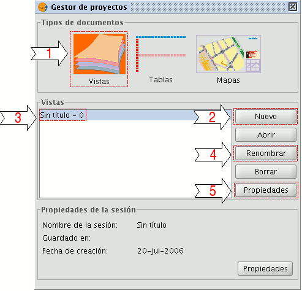

# Normas y recomendaciones

## Tiempos y modos verbales

El registro del texto debe enmarcarse dentro de lo que se llaman 
*"textos instructivos"*, lo que implica que lo correcto científicamente 
es utilizar la segunda persona (tú / usted) y el imperativo como modo verbal.

La justificación es que en los textos instructivos se establece una 
relación jerárquica entre el emisor y el receptor ya que el emisor es 
el que posee la información. La utilización de formas impersonales 
denota una mayor ambigüedad y la relación se convierte en más indirecta. 
También se puede utilizar el infinitivo aunque no es lo más deseable. 

Recomendaciones sobre los textos científicos: 

a) Evitar toda referencia personal: 

   Oraciones pasivas, pasiva-reflejas e impersonales con *‘se’*.

   Plural de modestia: *“como pudimos advertir en el comentario...”*.

   Formas no personales del verbo.

b) Alcanzar la exhaustividad:

   Complementación abundante

c) Buscar la claridad expositiva:
   
   Alejamiento de las formas coloquiales.

   Uso de expresiones que garanticen la coherencia interna del texto y 
   la comprensión del receptor 

   Uso de la definición, mediante la cual se elimina la posible 
   ambigüedad de los términos, y de las aclaraciones, bien mediante 
   paréntesis, bien mediante coordinadas explicativas. 

   Formalización o reducción a símbolos de los términos y de las 
   reglas que los combinan. También, aunque no sea un rasgo lingüístico, 
   el uso de diagramas, esquemas, fotos o cualquier otro recurso icónico.

Consideramos que los *manuales* son textos en el que no hay relación 
con el lector, de manera que utilizamos usted y el imperativo como modo verbal
(pulse el botón, seleccione el parámetro que desee, para realizar tal o cual 
cosa pulse el botón X a continuación seleccione el parámetro tal ...) 

Por otro lado consideramos que los *tutoriales*, *guías* y la documentación en 
la que se explican ejercicios en general, la relación con el lector es más estrecha, 
por lo que utilizamos la primera persona del plural (nosotros) pero el modo verbal 
no lo cambiamos (pulsamos el botón, seleccionamos el parámetro, para realizar 
tal o cual cosa pulsamos el botón X, a continuación seleccionamos el parámetro tal ...). 

## Inclusion de imágenes o diagramas 

A la hora de insertar una imagen o diagrama en un documento, hay que tener
en cuenta algunas consideraciones.

1.  Adecuar el tamaño de las imágenes a lo que se quiere mostrar en ellas. 
    Es decir, para mostrar una entrada de la barra de menús
    probablemente no haga falta una imagen de 1400 px.
    
    En general no usaremos imágenes de más de 800x600 píxels.
    
    Una práctica muy habitual en la confeccion de los manuales es
    capturar pantallas a resoluciones altas, por ejemplo 1200x1024 
    píxels, y luego reducirlas utilizando herramientas de manipulación
    de imágenes para incluirlas en la documentación. Esta práctica **no
    debe realizarse nunca**. Las imágenes resultantes no tienen una
    calidad aceptable y los textos de estas no se leen o se leen
    con mucha dificultad. Deberemos capturar las imágenes al tamaño
    con el que vayan a ser incluidas en la documentación para
    evitar perdidas de calidad en ellas, o limitarnos a recortar
    al área de interés sin alterar la resolución de estas.

2.  Si en el texto aparece la alusión a algún botón, ventana, 
    diálogo, éste debe estar perfectamente identificado. 
    Esto no significa que sea necesario realizar una captura 
    individual de todos los botones, la mayoría de las veces 
    bastará con una imagen de la interface 
    que sea en la que se identifiquen los elementos que interesen.

    Por ejemplo:

    
       
    Composición ventana gestión de proyecto

    * **1**. Selección tipo de documento "Vistas".

    * **2**. Botón "Nuevo". Permite la creación de un nuevo documento.

    * **3**. Títulos de los documentos "Vistas" creados. Por defecto, "Sin titulo – 0".

    * **4**. Botón "Renombrar". Permite cambiar el nombre de la "Vista" seleccionada.

3.  La profundidad de color de la imagen deberá ir acorde a esta, es decir, 
    si una imagen contiene poca variedad de color, utilizaremos una profundidad de
    color baja, y si tiene mucha utilizaremos una profundidad de color alta. Esto 
    normalmente se refleja utilizando una imagen con paleta de colores para aquellas
    con poca variedad de color y en formato RGB para las que tienen mucha variedad.
    
    Además de usar imágenes con paleta de colores, deberemos intentar tener el número de
    colores de la paleta lo más bajo posible manteniendo una buena calidad de visualización.

4.  El formato de las imágenes a utilizar irá a la par de la profundidad de color de esta.
    Para imágenes con paleta de color utilizaremos el formato PNG, y para imágenes 
    en formato RGB utilizaremos el formato JPEG.
  

## Otras recomendaciones 

1.  No debemos presuponer que el usuario sabe cosas de la herramienta, 
    es preferible que haya información inecesaria a que no haya 
    información de algo porque se ha considerado que es evidente.

2.  Nunca numeraremos los títulos de los documentos. Es fácil que 
    en algún momento insertemos o borremos un documento y nos descuadre
    toda la numeración, o incluso que desde otra parte de la web se haga
    referencia a alguno de nuestos documentos y la numeración establecida
    no sea la correcta en el contexto en el que se incluya el documento.

3.  Nunca numeraremos los títulos o secciones dentro de un documento.

4.  Nunca utilizaremos una numeración manual para simular viñetas numeradas.
    Si necesitamos utilizar viñetas numeradas utilizaremos unicamente las
    herramientas ReStructuredText_ para ello, aunque perdamos la posibilidad de 
    anidar la numeración de las viñetas (1.1.1, 1.1.2, 1.2.1,...).

