 encoding: utf-8 

 Como asignar a un campo un lista de valores cerrada basada en los 
contenidos de otra tabla 

En este documento vamos a ver como asignar a un campo de una tabla una lista de 
posibles valores, de forma que cuando se muestre el formulario de la tabla nos
presente un desplegable para elegir de él los valores que podamos asignar al campo.

Para explicar esto, vamos a utilizar la tabla **vertical_signal**. Esta tabla representa 
a la entidad de una placa de una señal de tráfico. Esta entidad tiene un atributo o campo
**verticalsignalmaterial**, que solo tiene dos valores posibles, *acero*, y *aluminio*.

Lo que haremos sera crear una tabla **materiales** en la que almacenaremos los posibles
valores del campo **verticalsignalmaterial**, y luego estableceremos una relacion entre
esta tabla de **materiales** y la tabla de **vertical_signal**.

El proceso comienza tras iniciar *gvSIG Desktop* ejecutando en el menú ***Vista***
la opción ***new layer***.


Como resultado de lo anterior se obtiene el siguiente cuadro de diálogo que nos
permite seleccionar en el panel la creación de una ***nueva capa Shape*** o una 
***nueva tabla de un base de datos (using JDBC)***. Seleccionando esta última 
opción de entre los dos.


Se pulsa el botón ***Siguiente*** situado en la zona inferior de la ventana para 
continuar el proceso. 

El siguiente panel esta destinado a evitar problemas a la hora de definir el nombre
de la tabla así como los campos que la componen. Con esta ventana se asegura que los
nombres de los campos estén en minúsculas y presenten guión bajo ```'_'``` en vez de
espacios y guiones ```'-'```.

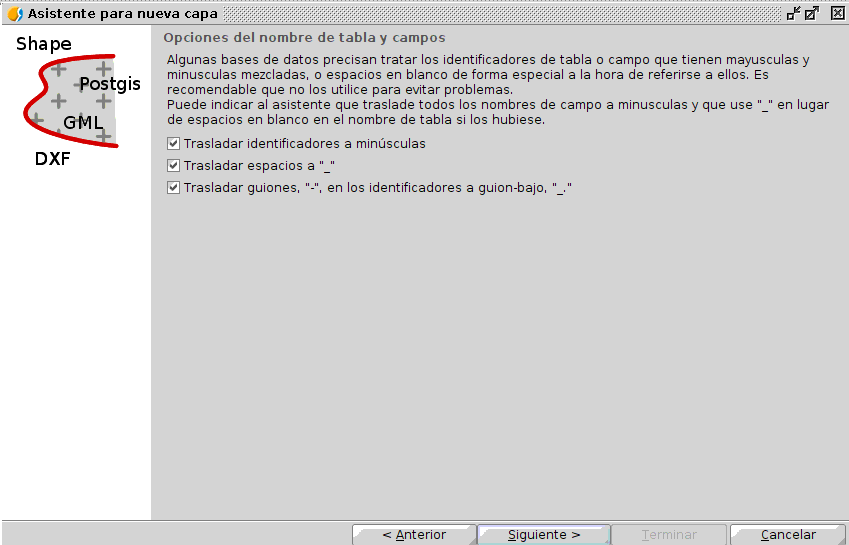

Se seleccionan las tres opciones y se pulsa el botón ***Siguiente*** situado en la 
zona inferior de la ventana para continuar el proceso. 

En este panel hay que especificar la base de datos donde se va a almacenar la nueva tabla.
Hay que decir que la base de datos tiene que estar creada de antemano. El proceso de 
selección se basa en identificar la base de datos en el primer desplegable o especificar un
nombre, tipo de conector y fichero en los desplegables ***Nombre de conexión, Conector y 
Fichero*** respectivamente si la base de datos no se encuentra.

En el caso del ejemplo, se dispone de una base de datos llamada *crearCapa*. 


Se pulsa el botón ***Siguiente*** situado en la zona inferior de la ventana para continuar
el proceso.

El siguiente panel del cuadro de diálogo define el esquema de la base de datos donde se 
quiere almacenar la tabla y el nombre de esta.

Se especifica el esquema *PUBLIC* y como nombre de tabla *materiales*. Tras esto, se pulsa 
el botón ***Siguiente*** situado en la zona inferior de la ventana para continuar el proceso. 

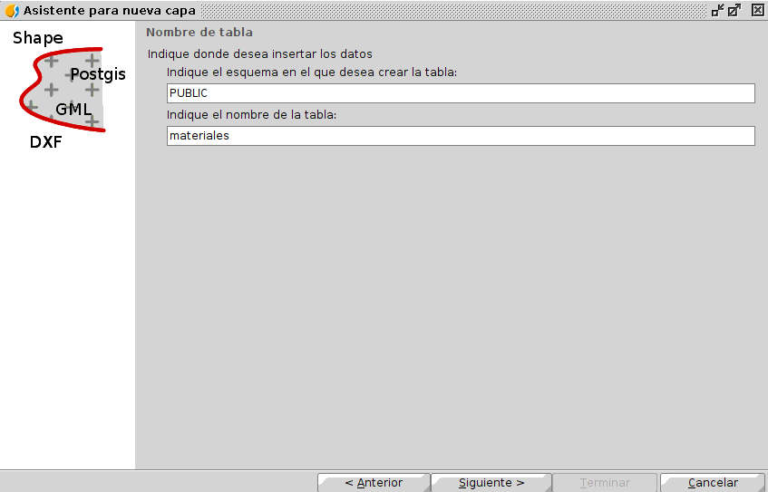

En el siguiente panel se detalla los campos o columnas de la tabla. Sin duda es el panel 
más importante a la hora de la creación de la tabla ya que define el esquema de datos de esta.


El proceso se inicia con la creación de un nuevo campo. Para realizar esto hay que pulsar 
el botón ***Nuevo*** situado en el margen derecho de la ventana.


Como resultado de la ejecución, y tal y como se muestra en la imagen anterior se crea un campo 
por defecto llamado *Campo1*, de tipo *String*, *tamaño 50*, *tipo de relación igual a ninguno*….

Tras la creación de este, se ha puesto la capa en edición de manera automática y se permite 
cambiar los parámetros que lo definen. De modo que, siguiendo el ejemplo, el nuevo campo tiene 
que presentar los siguientes parámetros:
 * Nombre de campo --> *name*
 * Tipo del campo --> *String*
 * *El campo es *clave primaria*.

Todos los valores anteriores pueden detallarse en la pestaña ***Campos básicos***. Concretamente 
el nombre *name* se puede definir en el ***cuadro de texto Nombre de campo***, el tipo de 
campo se detalla en el desplegable ***Tipo de Campo o el icono adyacente*** a este que 
ofrece una mayor colección de tipo de datos. Un campo se combierte en clave primaria con 
marcando la opción ***Clave primaria***.

Tras modificar lo anterior aceptamos guardar los cambios sobre el campo *name* pulsando
el botón ***Aceptar*** del margen derecho, lo cual hace que este presente los parámetros 
correctos en la lista de campos del *Gestor de columnas*.

A parte de ese campo *name* se crea otro de iguales características llamado *value*, 
eso si este no será una clave primaria. El resultado final de la ventana es el siguiente.


Se pulsa el botón ***Siguiente*** situado en la zona inferior de la ventana para 
continuar el proceso.

En esta ventana se especifica si se desea crear un índice espacial que optimice los 
cálculos en caso de que la tabla presente geometrías. 


En el caso del ejemplo, como no se dispone de geometría se pulsa el botón ***Siguiente*** 
para continuar con el proceso.

El siguiente panel configura los permiso de la tabla.


En el caso del ejemplo se pulsa el botón ***Siguiente*** para continuar con el proceso.

En este panel se especifican las secuencias a realizar después de la creación de la tabla.

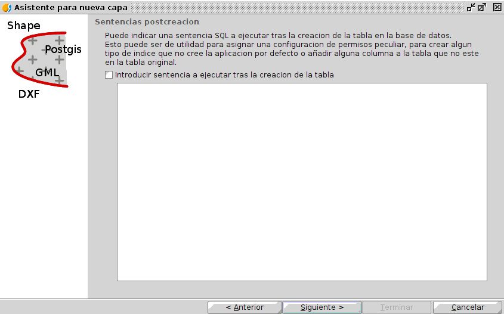

En el caso del ejemplo se pulsa el botón ***Siguiente*** para continuar con el proceso ya
que no queremos ejecutar sentencia alguna.

En esta última ventana termina el proceso de creación y se indica si se desea añadir la 
tabla a la vista.

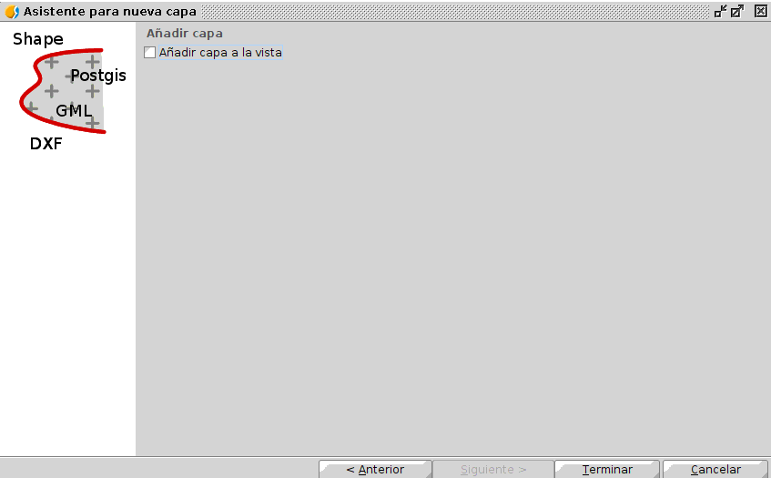

En el caso del ejemplo se desmarca añadirla a la vista puesto que la capa no posee 
geometrías y se pulsa el botón ***Terminar*** para finalizar con el proceso. En el 
caso de que la tabla presente geometrías puede optarse por cargar en la vista.

El siguiente paso lógico es tras la creación de la tabla materiales es rellenar esta
con la lista de valores. Para realizar lo anterior, en primer lugar hay que abrirla.
Para abrir la tabla hay que realizarlo desde el ***Gestor de proyectos*** situado en
el menú ***Mostrar*** de *gvSIG Desktop*. 

El proceso de abrir una tabla es el genérico a abrir cualquier archivo, 
primero se selecciona ***Tabla*** como tipo de datos a abrir, se selecciona la opción
de ***Nuevo***, lo que habilita una ventana donde se tiene que seleccionar la pestaña
***Base de datos***. Esa pestaña muestra en su zona superior un desplegable donde hay
que especificar la base de datos donde se encuentra la tabla. Una vez seleccionada la
base de datos, en la lista de tablas de esta hay que marcar la tabla en cuestión y 
pulsa el botón ***Aceptar***. 

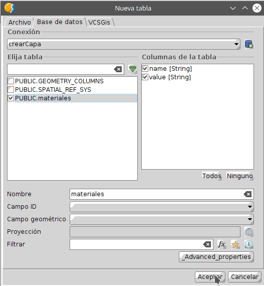

Tras la selección de este la tabla se muestra en una ventana del software. La siguiente
ilustración muestra la tabla *materiales* con la que se va a realizar el proceso, 
actualmente vacía.


Una vez abierta se pone en edición ejecutando en el menú ***Tabla*** de *gvSIG Desktop* el 
la opción ***Iniciar edición***.

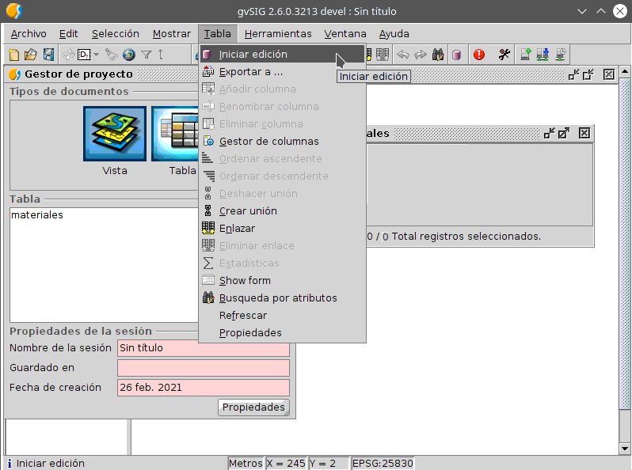

El proceso de añadir elementos a la tabla se realiza mediante la opción ***Añadir fila*** 
adyacente a la anterior, situado en el menú ***Tabla*** de *gvSIG Desktop*.


Tras esto en la tabla *materiales* aparece una nueva fila en blanco donde se introducen 
los valores del nombre y el valor del material en cuestión para el caso del ejemplo.

Los materiales que presentan las placas de las señales verticales de la 
tabla *vertical_signal* son los siguientes;

* name: *Acero*, value: *STEEL*
* name: *Aluminio*,  value: *ALUMINUM*

De modo que tras introducirlos la *tabla materiales* presenta la siguiente forma.


Solo queda ahora finalizar edición ejecutando la opción ***Detener edición*** situado
en el menú ***Tabla*** de *gvSIG Desktop* y guardar los cambios de la tabla.


Una vez creada la tabla en cuestión solo queda establecer la relación con las tablas 
que la utilicen. Para ello hay que realizar el procedimiento especificado en el 
documento [Como establecer una relacion maestro detalle entre dos tablas.](https://github.com/gvSIGAssociation/gvsig-desktop-docs-es/blob/master/docs/herramientas/gestor_de_columnas/maestro_detalle/maestro_detalle.md)

A modo de ejemplo y siguiendo con el uso de la tabla de materiales vamos a establecer 
la relación maestro-detalle entre la tabla *vertical_signal* y la tabla o diccionario 
*materiales*. Esta relación interesa establecerla únicamente desde el punto de vista 
uno a uno ya que una señal solo puede ser de un tipo de material. 
A continuación se muestran las dos tablas obtenidas con el *Gestor de proyectos*.

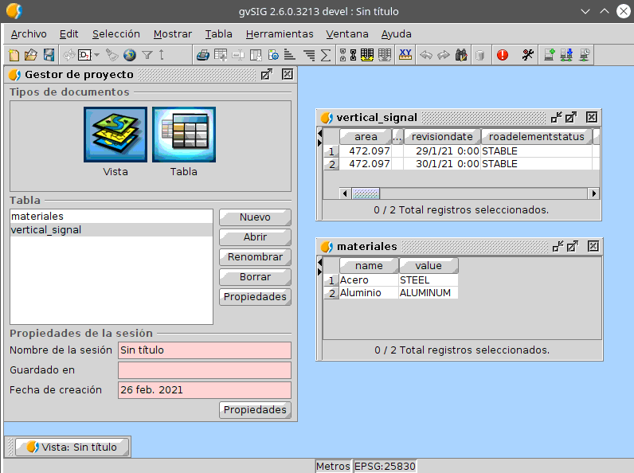

Para configurar la relación hay que obtener el gestor de la tabla vertical_signal
por lo que hay seleccionar la tabla en cuestión y aplicar la opción ***Gestor de columnas*** 
situada en el menú ***Tabla** de *gvSIG Desktop* siempre y cuando la tabla este abierta. 


Como resultado se obtiene el siguiente cuadro de diálogo, *gestor de columnas* 
de la tabla *vertical_signal*.


Esta herramienta permite al usuario definir la estructura de datos de la tabla, 
así como su representación o visualización. La realización de los cambios se lleva 
a cabo por columnas y permite modificar estas, crear otras nuevas e incluso eliminarlas 
si es necesario.

Como se busca definir una relación entre las dos tablas hay que buscar el campo 
que la establece, en este caso *verticalsignalmateriales*. Para establecer la relación
hay que seleccionar en el *gestor de columnas* de la *tabla vertical_signal* el campo 
que establece dicha relación, campo *verticalsignalmateriales*.


Una vez seleccionado se inicia su edición pulsando el botón ***Modificar*** 
situado en la zona derecha de la ventana.

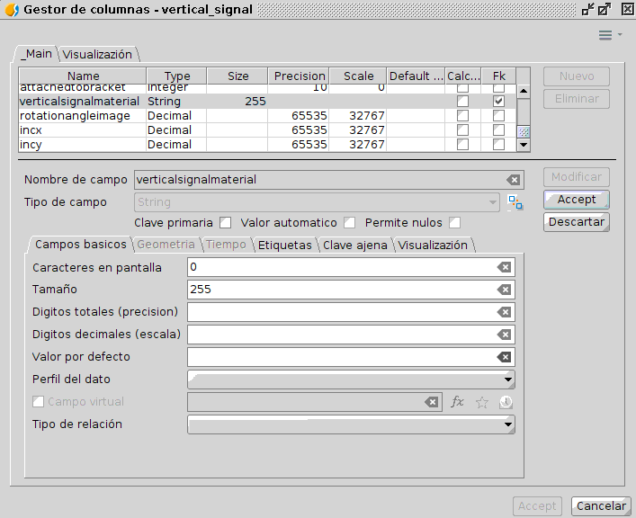

Tras lo anterior se habilitan una serie de pestañas que permiten modificar todo
lo referentes a los datos y su representación del citado campo. Para establecer
la relación hay que modificar el contenido de dos pestañas, la pestaña ***Campos 
básicos*** y la pestaña ***Clave ajena***.


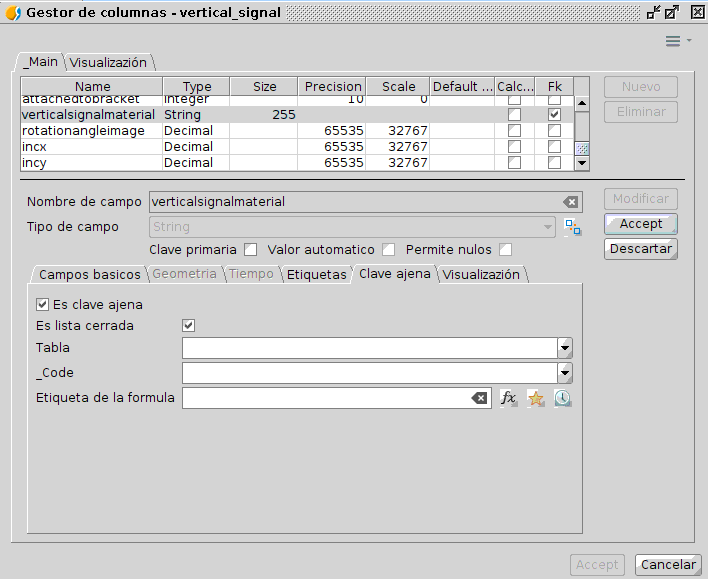

La configuración comienza especificando en la pestaña ***Campos básicos***.
En este caso concreto de establecer relación entre tablas uno a uno del ejemplo,
se pasa de no tener relación alguna a *Colaboración (1:1)* ya que como se detalla 
en el ejemplo una señal solo puede estar compuesta de un material

Tras lo anterior se inicia la configuración de la pestaña ***Clave ajena***, 
seleccionando en primer lugar si el campo es *clave ajena*, el cual lo es en el 
caso del ejemplo, tras esto hay definir si dicho campo es *clave ajena de una lista
cerrada o no*. En el caso de ejemplo, la tabla *materiales* es una tabla cerrada por
lo que hay que especificarlo.

 > La única diferencia entre marcar si es una lista cerrada o no es la 
 representación de los valores de esta en el formulario de la tabla de la 
 clave ajena, en este caso en el *formulario de vertical_signal*.

Una vez seleccionados los elementos anteriores hay que definir la tabla
de la cual el campo es clave ajena, así como el campo que queremos que 
muestre en el formulario y una fórmula para la representación o visualización 
de los datos.

Según el orden de los parámetros definidos en el párrafo anterior la 
*tabla* sería *materiales*, el campo sería *value* y la *fórmula 
especificada* es *name*.

La configuración de las pestañas se puede ver en la siguiente imagen:

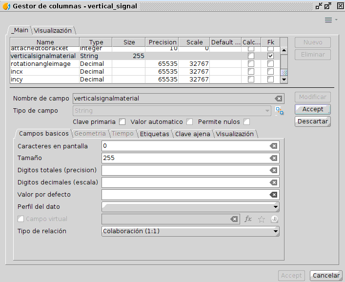
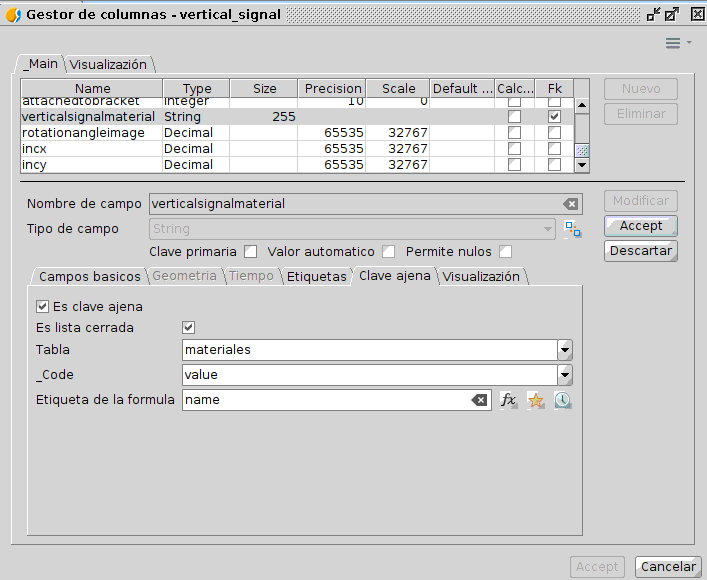

Tras lo anterior solo queda terminar la modificación del campo pulsando 
el botón ***Aceptar*** del margen derecho y terminar el proceso en el 
*Gestor de columnas* pulsando el ¡botón ***Aceptar*** situado en la 
esquina inferior derecha de dicha ventana.

Para visualizar si la relación entre tablas se ha establecido, solo 
hay que aplical la opción ***Show form*** situado en el menú ***Tabla***
de de *gvSIG Desktop* estando la tabla *vertical_signal* abierta y 
seleccionada. En la siguiente ilustración se muestra el formulario de 
la tabla y el desplegable de materiales con los elementos de la tabla
*materiales*.

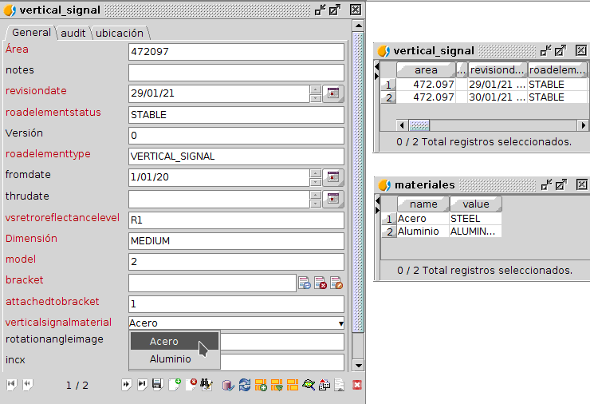
