 encoding: utf-8 
 Ejemplo asignación de recursos  

Para facilitar la comprensión del proceso de asignación de recursos a una determinada capa a
continuación se presenta un ejemplo. En este se va a asociar una leyenda a una capa presente
en un repositorio.

La capa utilizada para la realización del ejemplo llamada *EDIFICIOS* está almacenada en una 
capa de polígonos con la geometría de los edificios de la ciudad de Alicante y que ya esta
bajo el control de versiones. Esta capa presenta las siguientes características;
 * Repositorio: *aytoALC*
 * Copia de trabajo: *usuario1*
 * Categoría: *BASE*
 
La siguiente ilustración muestra la capa cargada en *gvSIG Desktop*.

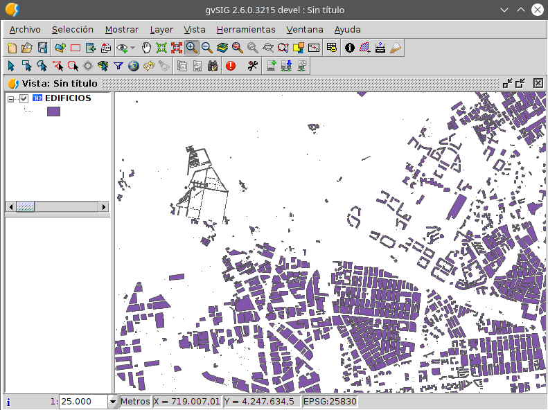

Tal y como se puede ver, la simbología presenta una leyenda por defecto. 
Para cambiarla y registrarla en el repositorio de modo que siempre
que se utilice dicha capa se presente con la leyenda correcta hay que registrar 
la nueva leyenda como recurso.

En primer lugar hay que crear la tabla de recursos. Dicho proceso  se realiza mediante la opción 
*Crear tabla de recursos* situada en el menú *Herramientas*, submenú *VCSGis*, submenú 
*Administración*.


Realizar lo anterior muestra el siguiente cuadro de diálogo.

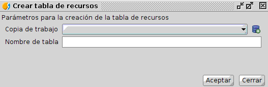

En la ventana hay que seleccionar en el primer desplegable llamado *Copia de trabajo* la copia 
de trabajo donde esta la capa, *usuario1*.

En el segundo componente hay que detallar el nombre de la tabla de recursos. Se nombra la nueva 
tabla de recursos como *BASE_RESOURCES* ya que en este ejemplo vamos a almacenar todos los recursos 
de la categoría *BASE* en dicha tabla.

Hay que tener en cuenta que se pueden crear tantas tablas de recursos como se deseen. De modo 
que se puede crear una única tabla de recursos que almacene todos ellos o varias de estas que 
almacenen los recursos de determinadas categorías de datos por ejemplo.  Normalmente agruparemos
las tablas del repositorio de forma que grupos lógicos de tablas usen la misma tabla de recursos,
así balancearemos la carga de esta tabla y los usuarios que no trabajen con las capas de un
bloque lógico no precisaran descargarse los recursos de esta.

El proceso de creación finaliza pulsando el botón *Aceptar* en la esquina inferior derecha de 
la ventana.

El siguiente paso a seguir es almacenar un recurso en la tabla recientemente creada. Para ello es necesario
disponer de él o crearlo desde cero. En el caso del ejemplo se procede a crear de cero la leyenda
para la capa *EDIFICIOS*.

Para crear una leyenda hay que ir al árbol de capas situado en el *Toc* de *gvSIG Desktop* y tras
selección de la capa en cuestión pulsar botón derecho del mouse y seleccionar la opción *Propiedades*.

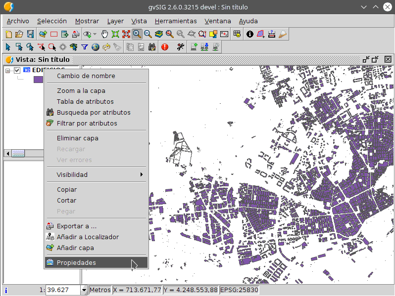

La opción anterior presenta la siguiente ventana.


Se selecciona la pestaña *Simbología* pues en esta se especifica todo lo referente a la 
representación gráfica de la capa. El panel de la pestaña anterior es el siguiente.


Una vez allí y continuando con el caso del ejemplo, se selecciona la opción *Símbolo único* de
dentro de *Objetos* del cuadro de opciones de simbología situado en la parte izquierda del panel.

Dicha selección habilita el siguiente panel en la ventana.

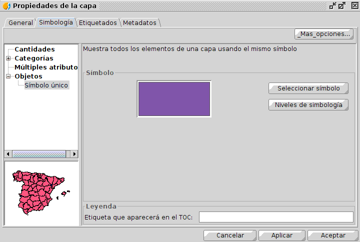

En el panel se inicia el proceso de definición de nuestra leyenda pulsando el botón
*Selección símbolo* el cual presenta el cuadro de diálogo *Selector de simbología*.

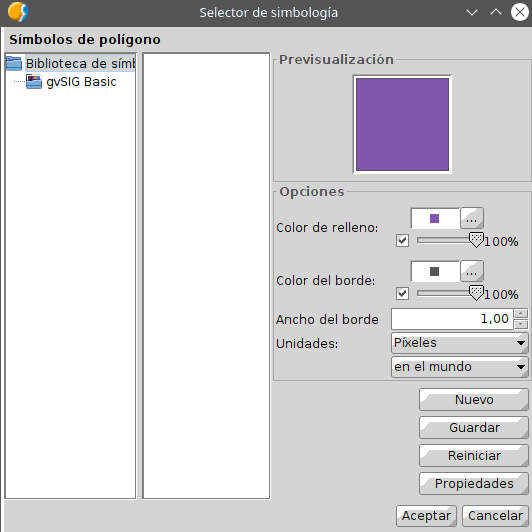

En esta nueva ventana hay que definir las características gráficas de los elementos de la capa,
en este caso polígonos. Por lo tanto hay que definir como se van a representar sus bordes e interior.
Los parámetros para los bordes e interior de los polígonos de la capa edificios se detallan
a continuación.

|**Componente**|**Color(RGB)**  |**Opacidad**|**Ancho (píxel)**
|--:           |--:             |:--         |:--      
|Borde         |231   120   58  |100%        |1        
|Interior      |248   190   132 |100%        |-        

Una vez especificados se aceptan los cambios pulsando el botón *Aceptar* y se cierra el cuadro 
de diálogo 

Tras lo anterior ya de nuevo en el panel de la pestaña *Simbología* de la ventana *Propiedades*
de la capa *EDIFICIOS* se puede ver que el símbolo único ha cambiado según la definición 
especificada anteriormente. 

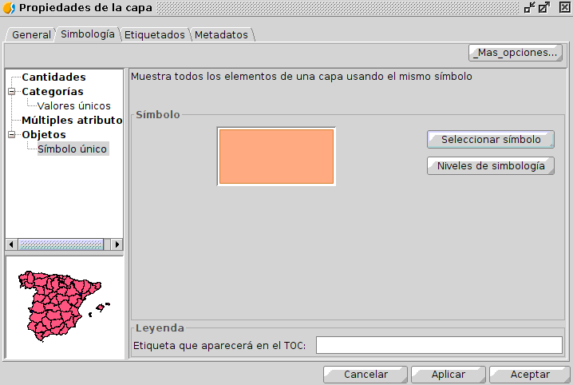

Solo queda ahora almacenar esa simbología pulsando el botón *Más opciones* situado en la 
zona superior derecha de la ventana y seleccionar a continuación la opción *Guardar leyenda*.


La opción anterior presenta un cuadro de diálogo que nos permite indicar la ruta donde almacenar la
leyenda y el nombre del fichero que almacenará esta. En el caso del ejemplo se almacena en 
una carpeta destinada a almacenar leyendas y el nombre del archivo es el mismo que la capa con la 
extensión ```.gvsleg```, es decir *EDIFICIOS.gvsleg*. Hay que indicar que el archivo con el 
recurso siempre tiene que llamarse de la misma manera que la capa de la que es recurso.

Una vez guardada la leyenda, pulsamos los botones *Aplicar*  y *Aceptar* para terminar el proceso de
definición de la simbología de la capa.

Con el recurso ya creado, hay que introducir este en la tabla de recursos, *BASE_RESOURCES*.

En primer lugar hay que abrir la tabla *BASE_RESOURCES*. Para abrir la tabla hay que realizarlo 
desde el *Gestor de proyectos* situado en el menú *Mostrar* de *gvSIG Desktop*. El proceso de 
abrir una tabla es el genérico a abrir cualquier archivo, primero se selecciona *Tabla* como 
tipo de datos a abrir, se selecciona la opción de *Nuevo*, lo que habilita una ventana donde se 
tiene que seleccionar la pestaña *Base de datos*. Esa pestaña muestra en su zona superior un 
desplegable donde hay que especificar la base de datos donde se encuentra la tabla, *usuario1*. 
Una vez seleccionada la base de datos, en la lista de tablas de esta hay que marcar la tabla 
en cuestión y pulsa el botón *Aceptar*.

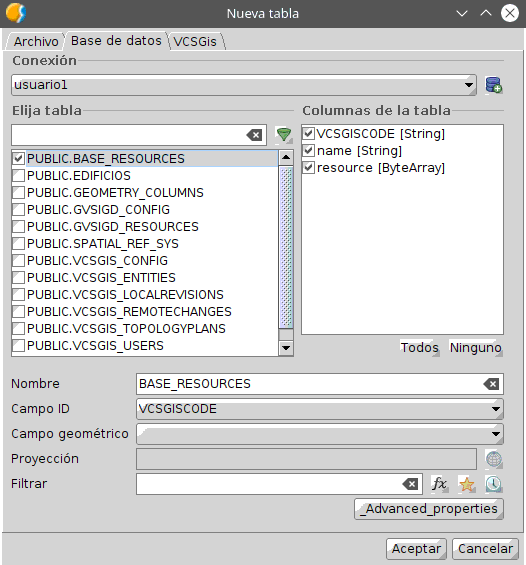

Como resultado se obtiene la tabla vacía. Para rellenarla hay que obtener su formulario,
seleccionando la opción *Show form* situada en el menú *Tabla* de *gvSIG Desktop* siempre 
y cuando la tabla esté abierta y seleccionada.

El formulario de la tabla *BASE_RESOURCES* es el siguiente.

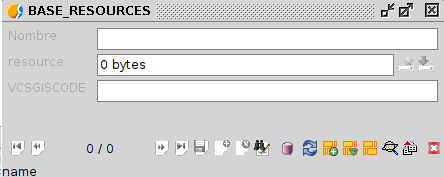

Para introducir un valor en la tabla hay que poner esta en edición, ya sea desde
el mismo desplegable que se mencionó anteriormente para obtener el formulario, o desde el mismo 
formulario utilizando el botón *Comenzar edición*.

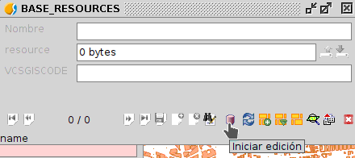

Una vez en edición hay que crear un nuevo elemento mediante el botón *Nuevo* situado en la zona 
inferior del formulario e indicado en la imagen siguiente.


Especificamos en el campo *nombre* el nombre de la tabla más la extensión asociada al 
recurso que se desea almacenar y en el campo *value* gracias al botón izquierdo se puede subir a 
la tabla dicho fichero.

En el caso del ejemplo la configuración del formulario es la siguiente.

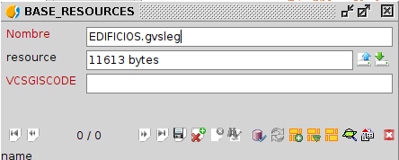

Una vez creado el nuevo elemento de la tabla solo queda guardar.

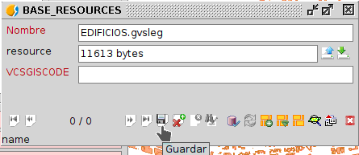

Y posteriormente finalizar la edición de la tabla.

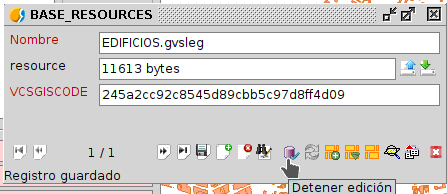

Tras crear y rellenar la tabla hay que subir esta al repositorio. Para hacer lo anterior hay que añadir 
la tabla a la copia local, opción *Añadir a la copia de trabajo* del menú *Herramientas*, submenú *VCSGis*,
y posteriormente realizar un *commit* tras ejecutar la opción *Mostrar cambios* situada en el menú 
*Herramientas*, submenú *VCSGis*.

Tras la correcta definición de la tabla recursos hay que asignar a la capa *EDIFICIOS* del 
repositorio dicha tabla como su tabla de recursos. Para ello hay que abrir la tabla *VCSGISREPO_ENTITIES* situada 
en el repositorio *aytoALC*. Para abrir la tabla hay que realizarlo desde el *Gestor de proyectos*
situado en el menú *Mostrar* de *gvSIG Desktop*. El proceso de abrir una tabla es el genérico 
a abrir cualquier archivo, primero se selecciona *Tabla* como tipo de datos a abrir, se selecciona 
la opción de *Nuevo*, lo que habilita una ventana donde se tiene que seleccionar la pestaña 
*Base de datos*. Esa pestaña muestra en su zona superior un desplegable donde hay que especificar 
la base de datos donde se encuentra la tabla, *aytoALC*. Una vez seleccionada la base de datos, en
la lista de tablas de esta hay que marcar la tabla en cuestión y pulsa el botón *Aceptar*.

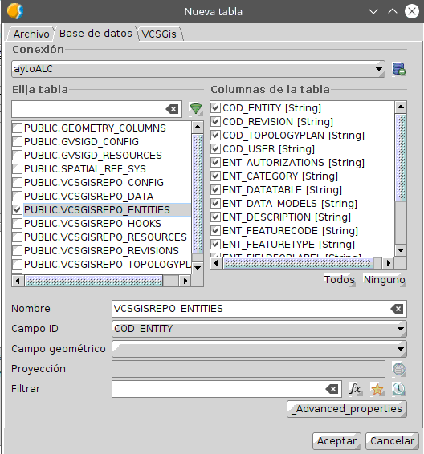

La siguiente imagen muestra la tabla *VCSGISREPO_ENTITIES* donde por el memento hay dos 
entidades, la capa/tabla *EDIFICIOS* y la tabla *BASE_RESOURCES*.

El proceso de asignación de los recursos se realiza modificando la entidad a la que se desea asignar 
el recurso, en este caso la capa *EDIFICIOS*. Para ello es necesario obtener el formulario asociado 
la capa *VCSGISREPO_ENTITIES*. Para obtener el formulario de la tabla seleccionaremos la opción
*Show form* situada en el menú *Tabla* de *gvSIG Desktop* siempre y cuando la tabla esté 
abierta y seleccionada.

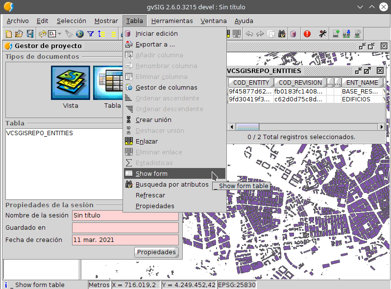

El formulario de la tabla es el siguiente.


Una vez en el formulario se identifica el elemento que hace referencia a la tabla/capa *EDIFICIOS*
y se inicia la edición de la tabla para la modificación de este. Este proceso se puede realizar desde
el mismo desplegable que se mencionó anteriormente para obtener el formulario, o desde el mismo 
formulario utilizando el botón *Comenzar edición*.

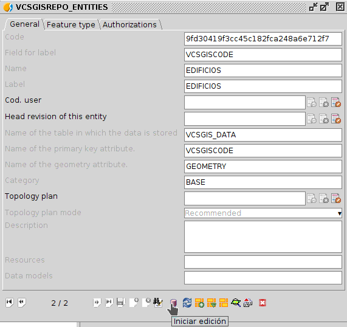

De los diferentes campos del formulario hay que identificar el referente a los recursos, llamado,
*Resources*. En este hay que especificar el nombre de nuestra tabla de recursos, *BASE_RESOURCES*, 
ya que la tabla/capa edificios pertenece a la categoría *BASE*.

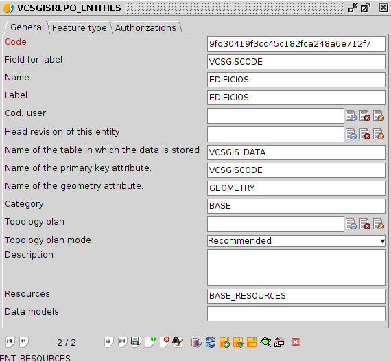

Solo queda guardar los cambios en la entidad.


Y terminar la edición de la tabla.


Tras lo anterior la asignación de los recursos mediante la tabla de recursos *BASE_RESOURCES* a la 
capa *EDIFICIOS* ha concluido. 

Para confirmar el proceso de asignación de un recurso de la tabla de recursos a una capa solo hay 
que hacer checkout de esta tabla en cuestión, tal y como se indica en el apartado [*Añadir una capa
del repositorio*](https://gvsigassociation.github.io/gvsig-desktop-docs/es/userdoc/vcsgis/utilizacion_basica/anadir_una_capa_del_repositorio_t.html).

Tras todo lo realizado anteriormente cualquier usuario que realice una descarga del repositorio de la 
tabla *BASE_RESOURCES* y la capa *EDIFICIOS* presentará la misma leyenda asociada.
