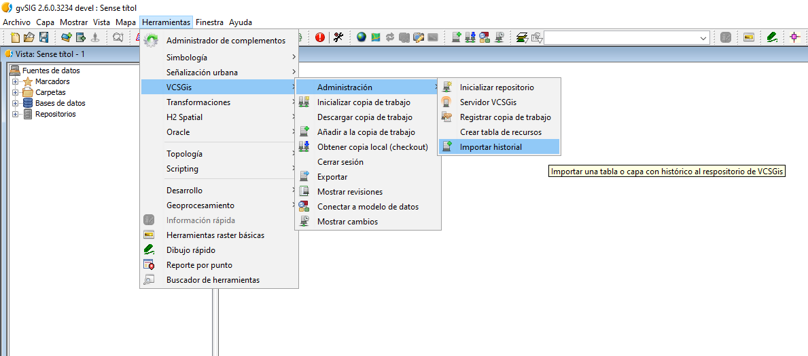

 encoding: utf-8 
 Importación o carga de historial de datos  

Otra funcionalidad presente en el control de versiones *VCSGis* de *gvSIG Desktop* es la de realizar el proceso de carga o importación de datos históricos siempre y cuando estos presenten un campo de carácter temporal que indique cualquier modificación de estado del elemento. Un ejemplo de esos estados sería su fecha de implantación, modificación , actualización, eliminación…

La opción *Importar historial* se encuentra en en la opción *Herramientas* del menú de gvSIG Desktop, pestaña *VCSGis*.

La ventana o interfaz resultante de ejecutar dicho comando se muestra en la siguiente ilustración.

En dicha ventana hay que especificar la copia de trabajo donde se almacenará el histórico en cuestión mediante un desplegable. Una vez seleccionada la copia de trabajo en la ventana hay que identificar el archivo donde se encuentra el historial, el cual debe estar cargado de antemano en *gvSIG Desktop* ya sea como tabla o capa. Tras lo anterior, la ventana dispone de una serie de campos y desplegables a completar, de los cuales hay que destacar el campo identificador el cual hace referencia a la clave primaria de la tabla y los campos que referentes a la inclusión de los datos  según fecha de revisión o código de revisión. Referente a estos campos últimos, existe la posibilidad de realizar las diferentes revisiones según fecha de revisión especificando un intervalo de agrupación o usando un código de revisión, previa identificación de este campo.

Como ejemplo para ilustrar el proceso anterior se muestra como la tabla *Reservas* de una base de datos ajena a *VCSGis* pasa a formar parte del control de versiones tras ejecutar el comando *Importar historial*.

Tras finalizar el proceso se puede comprobar que el proceso de carga fu correcto visualizando las diferentes revisiones creadas ejecutando el comando *Mostrar revisiones* dentro de la opción *Herramientas* del menú de *gvSIG Desktop*, pestaña *VCSGis*.

