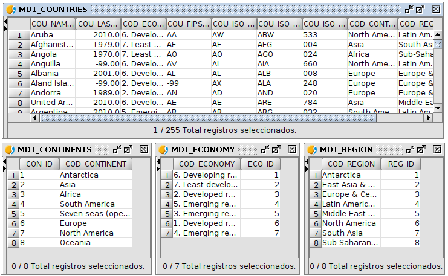
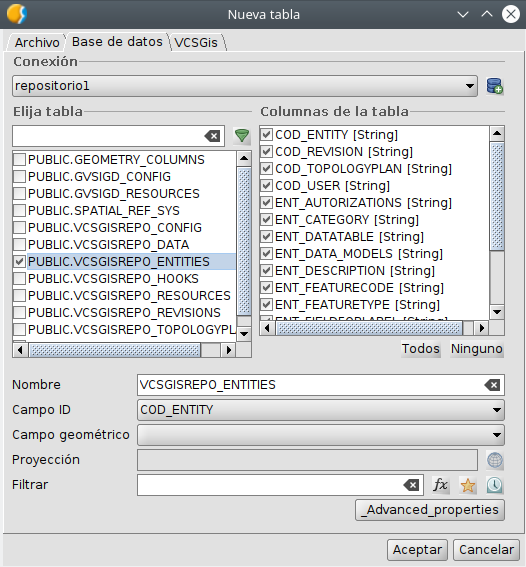
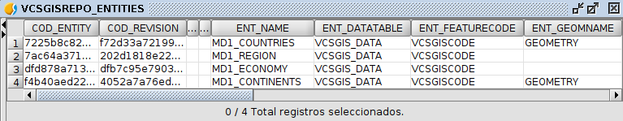
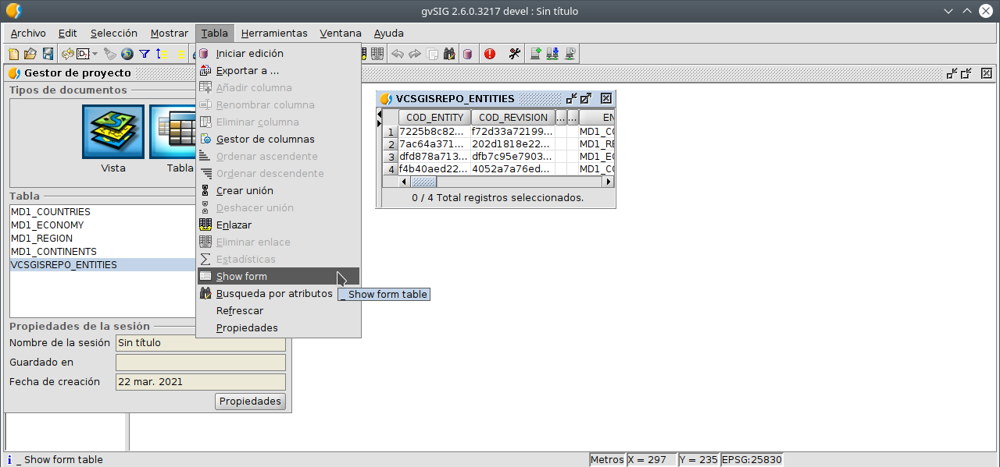
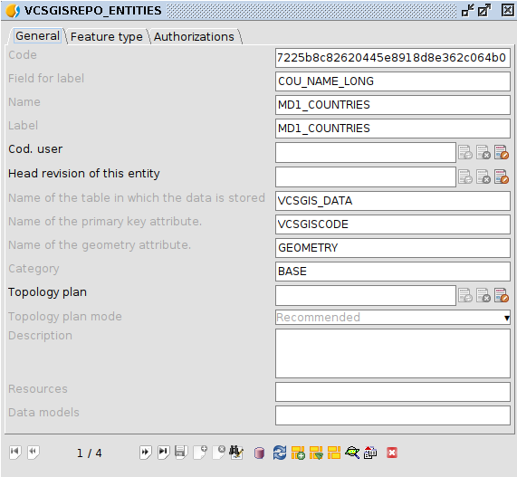
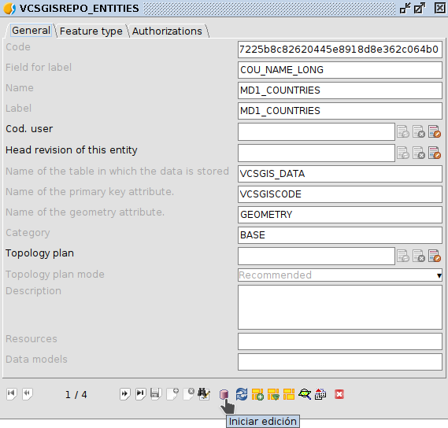
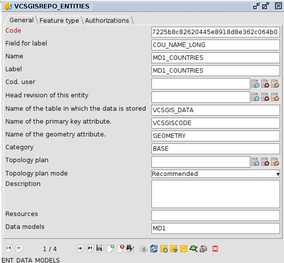
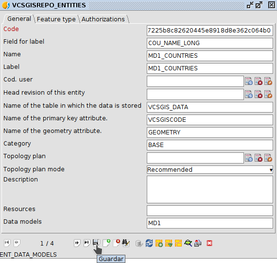

 encoding: utf-8 
 Configuracion modelo 

Configurar un modelo de datos en *VCSGis* requiere cierto análisis y organización. No esta pensado 
para crearse sin una planificación previa. Antes de añadir las tablas que forman el modelo se deben tener 
bien claras y declaradas las relaciones entre ellas, así como las restricciones que se buscan aplicar a 
los atributos de estas. Adicionalmente, también hy que declarar como se deben presentar los datos de las 
distintas tablas al usuario, normalmente en forma de *formularios*. 

Para realizar toda esta tarea hay que apoyarse en las herramientas de gvSIG desktop de *Crear nueva tabla o capa*
y el *Gestor de columnas*. Una vez declarada la información que define el modelo de datos, es posible añadir
las tablas que lo componen al repositorio de la herramienta de control de versiones *VCSGis*.

Ahora solo queda indicar a *VCSGis* que tablas de las que hay en el repositorio forman parte de un
modelo de datos. Para ello se necesita disponer de acceso de escritura a la base de datos en la
que reside el repositorio donde estan las tablas que forman el modelo. Cargaremos en el proyecto
de *gvSIG desktop* la tabla *PUBLIC.VCSGISREPO_ENTITIES* y, bien directamente sobre la tabla o en el formulario 
asociado a ella, indicaremos para cada "entidad" a que modelo de datos pertenece.

Para facilitar la compresión de la configuación de modelos de datos en la herramienta de control de
versiones *VCSGis* de *gvSIG Desktop* se utiliza el siguiente ejemplo. El ejemplo se basa en 4 tablas; 
**MD1_CONTINENTS**, **MD1_COUNTRIES**, **MD1_ECONOMY** y **MD1_REGION**, siendo el conjunto de ellas el 
modelo de datos **MD1**.

Para empezar la configuración hay que abrir la tabla del repositorio *PUBLIC.VCSGISREPO_ENTITIES* desde 
el *Gestor de proyectos* situado en el menú *Mostrar* de *gvSIG Desktop*. El proceso de abrir una tabla 
es el genérico a abrir cualquier archivo, primero se selecciona *Tabla* como tipo de datos a abrir, 
se selecciona la opción de *Nuevo*, lo que habilita una ventana donde se tiene que seleccionar la pestaña 
*Base de datos*. Esa pestaña muestra en su zona superior un desplegable donde hay que especificar la base 
de datos donde se encuentra la tabla. Una vez seleccionada la base de datos, en la lista de tablas de 
esta hay que marcar la tabla en cuestión y pulsa el botón *Aceptar*.

De lo anterior se obtiene la siguiente tabla.

En la tabla se muestran las cuatro tablas anteriores cargadas, pero hay que especificar, que aún no conforman un
modelo de datos. Para definirlo se tiene que modificar y añadir en ellas a que modelo de datos pertenecen. Para
realizar lo anterior hay que editar cada tabla de manera manual o mediante su fomulario. Para obtener el formulario
se ejecuta la opción *Show form* situada en el menú *Tabla* de *gvSIG Desktop* siempre 
y cuando la tabla este abierta y seleccionada.

El formulario de la tabla *PUBLIC.VCSGISREPO_ENTITIES* es el siguiente.

Para introducir un valor en la tabla hay que poner esta en edición ya sea desde
el mismo desplegable que se mencionó anteriormente para obtener el formulario, o desde el mismo 
formulario utilizando el botón *Comenzar edición*.

Tras esto se introduce en el campo *Data models* el modelo de datos al cual pertenece cada tabla o capa, en este
caso *MD1*.

Una vez asignado el modelo de datos se guarda dicho cambio.

Tras lo anterior hay que repetir el proceso con todas las tablas del modelo en cuestión y finalizar la edición de
la tabla *PUBLIC.VCSGISREPO_ENTITIES*

