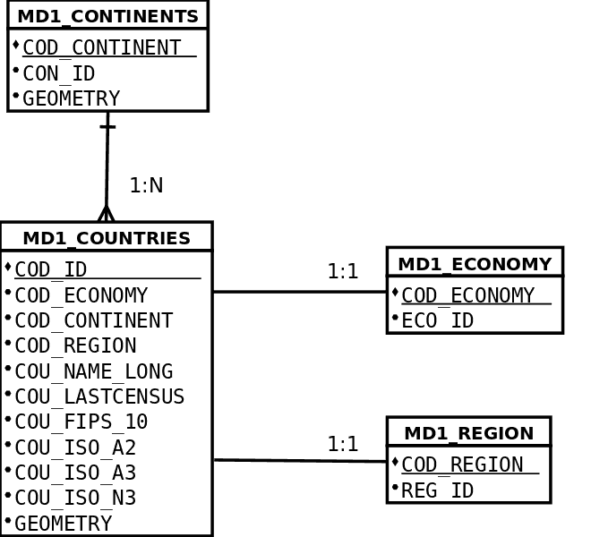

 encoding: utf-8 
 Introduccion  

(**en contruccion**)

Trabajar con problemas complejos muchas veces precisa realizar un análisis adecuado, y definir un modelo de
datos para representarlos de manera correcta. Normalmente el modelo de datos se materializa en un conjunto 
de tablas, registros, relaciones y restricciones de una base de datos relacional. 

Con *gvSIG Desktop* se puede acceder a esas tablas, realizar consultas, visualizar sus datos y si tienen información 
geográfica representarla en un mapa. De modo que, es posible ver cada una de las tablas que conforman el modelo 
de forma independiente o ver ese conjunto de tablas como un modelo de datos coherente, como un todo. Si se adopta
la última opción, hay que añadir a *gvSIG Desktop* información para que el sofware sea consciente de las 
relaciones que hay entre tablas, las restricciones establecidas para algunos de sus atributos, así como cual es
la forma de acceder a cada una de las tablas del modelo de datos. Normalmente se emplean dos herramientas de
*gvSIG Desktop* para realizar lo anterior, el *gestor de columnas* y los *repositorios de datos* o *espacios 
de trabajo de base de datos*. 

A través del *gestor de columnas* se declaran que relaciones existen entre las tablas. Por ejemplo, si se tiene 
una tabla de *facturas* y otra de *líneas de factura*, se define una relación entre ambas, indicando como obtener
las líneas de una factura, o como obtener la factura asociada a una línea de factura. *GvSIG Desktop*  permite 
declarar este tipo de relaciones entre las distintas tablas o entidades del modelo de datos, y luego cuando se
precisa presentar esta información a traves de formularios, adapta la presentación para que se pueda navegar 
entre las relaciones declaradas. Además, es posible usar estas relaciones para poder realizar búsquedas entre 
las distintas tablas del modelo de forma sencilla y más o menos transparente para el usuario.

Pero para poder "navegar" entre las distintas tablas de un modelo de datos, no solo es necesario declarar las 
relaciones que existen entre ellas; también se debe declarar como se puede acceder a cada una de las tablas 
que componen el modelo. Para esto hay que definir un *repositorio de datos*, en el que se indica donde esta 
almacenada cada tabla del modelo y como acceder a ella.

Centrando la atención en *VCSGis*, se ha integrado una herramienta que ofrece la posibilidad de cargar desde 
el repositorio del control de versionesque tanto la información relacionada con las restricciones y relaciones
tablas así como en donde se encuentran cada una de las tablas del modelo. De esta manera se puede almacenar 
la definición del modelo de datos para tablas ya integradas en el repositorio, pudiendo conectarse a ese modelo 
de datos, descargarlo y registrarlo de forma cómoda para el usuario.

Para ilustrar como configurar la parte de configuración de modelos de datos en el contexto de VCSGis
vamos a trabajar un modelo sencillo, con solo unas pocas tablas.

Las tablas seleccionadas para realizar el ejemplo son *countrie*, *continent*, *region* y *economy*. Estas tablas
representan paises, continentes, subregión y el tipo de región segun su economía respectivamente. Las relaciones
establecidas entre capas se detrallan en la siguiente ilustración:

