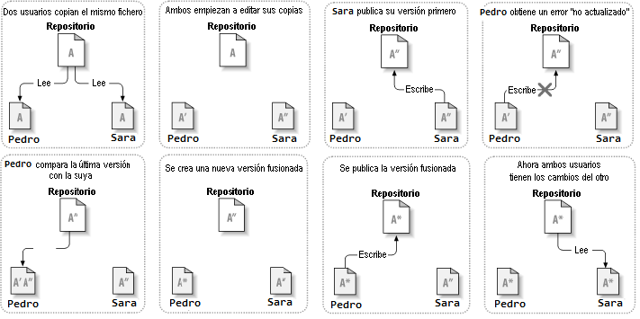

 encoding: utf-8 
 Copiar-Modificar-Fusionar  

*VCSGis* y otros sistemas de control de versiones usan el modelo Copia-Modificación-Fusión como  alternativa al modelo de bloqueo. En este modelo, cada cliente de los usuarios lee el repositorio y crea una **copia de trabajo** personal de las capas o tablas, de modo que los usuarios trabajan en paralelo, modificando sus copias privadas. Finalmente, las copias privadas son unificadas conjuntamente en una nueva versión final mediante el asesoramiento del sistema de control de versiones, pero es un humano en última instancia el responsable de hacer esta acción de manera correcta.

Para entender mejor lo anterior consideramos el siguiente escenario; Digamos que tanto Pedro como Sara crean copias de trabajo de la misma capa, copiadas del repositorio. Ellos trabajan simultáneamente, y hacen cambios al mismo archivo "A" dentro de sus copias. Sara es la primera en grabar sus cambios en el repositorio. Cuando Pedro intenta grabar sus cambios más tarde, el repositorio le informa que su archivo "A" está desactualizado. En otras palabras, que el archivo "A" en el repositorio ha cambiado de alguna forma desde la última vez que lo copió. Por lo que Pedro le pide a su cliente que fusione cualquier nuevo cambio del repositorio dentro de su copia de trabajo del archivo "A". Lo más seguro es que los cambios de Sara no se superpongan a los suyos; por lo que una vez que ambos conjuntos de cambios se han integrado, él graba su copia de trabajo de nuevo en el repositorio.

¿Pero qué ocurre si los cambios de Sara se superponen a los cambios de Pedro? ¿Qué hacemos entonces? La situación se denomina un **conflicto**, y normalmente no es problema. Cuando Pedro le pide a su cliente que fusione los últimos cambios del repositorio en su copia de trabajo "A",  se da el caso anterior, la copia de trabajo de Pedro marca  que está en un estado de conflicto. En ese estado de conflicto Pedro es capaz de ver ambos conjuntos de cambios conflictivos, y manualmente podrá elegir entre ellos cuál es el más acertado. Tenga en cuenta que el software no puede resolver conflictos automáticamente, ya que sólo los humanos son capaces de entender y hacer las elecciones necesarias de forma correcta. Una vez que Pedro haya resuelto manualmente los cambios que se superponían, puede guardar de forma segura el archivo fusionado al repositorio.

El modelo Copiar-Modificar-Fusionar puede parecer un poco caótico, pero en la práctica, funciona extremadamente bien. Los usuarios pueden trabajar en paralelo, sin que tengan que esperar nunca uno por otro, y cuando trabajan en los mismos archivos, resulta que la mayoría de los cambios concurrentes no se superponen en absoluto, siendo los conflictos muy poco frecuentes. Además, el tiempo que lleva resolver conflictos es mucho menor que el tiempo perdido por un sistema que implementa el modelo de bloqueo.

Como curiosidad decir que hay una situación donde el modelo Bloquear-Modificar-Desbloquear resulta mejor que este, y es cuando  se tiene archivos no-fusionables, por ejemplo imágenes. Si dos personas cambian una imagen a la vez, no hay forma de fusionar esos cambios, y uno de ellos perderá sus cambios.
