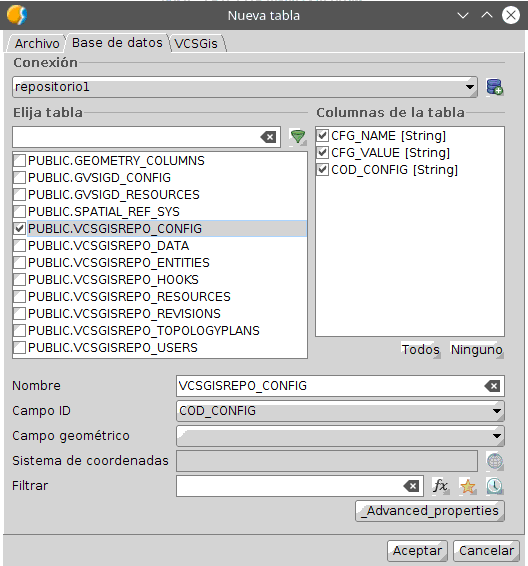
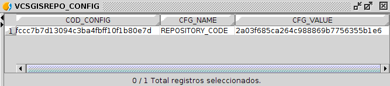
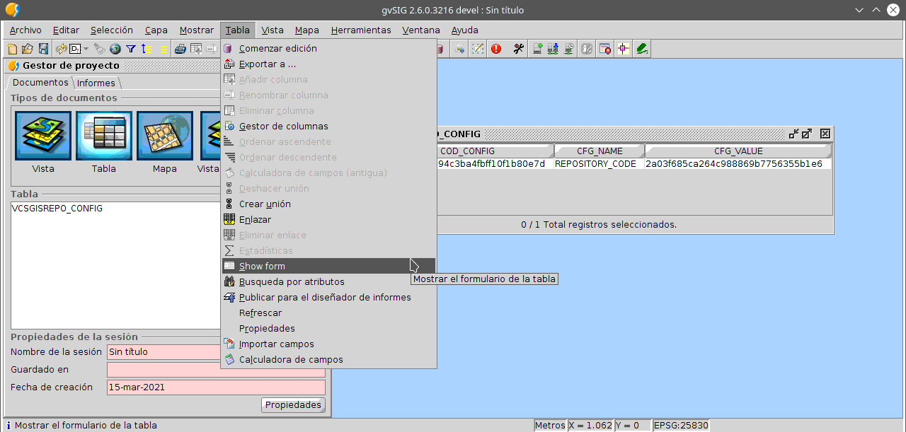
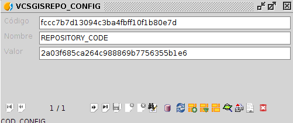
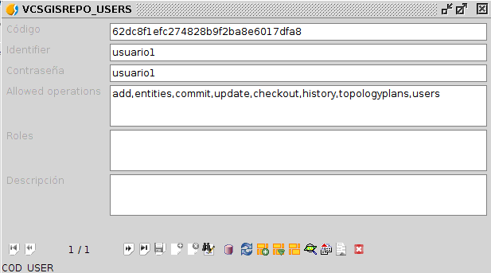
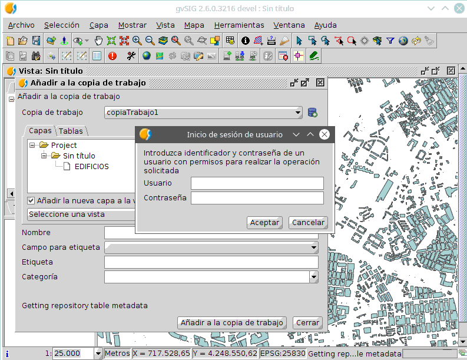

 encoding: utf-8 
 Autenticacion  

**(en construccion)**

Este nivel se basa en autorizar el acceso a determinada información mediante credenciales, usuario y contraseña 
concretamente. Si se activa  la autenticacion, se garantiza que solo los usuario que puedan certificar su 
identidad tienen acceso al sistema. Ahora bien, solo con este mecanismo, una vez accedan al repositorio, no 
se dispone de control de que operaciones pueden realizar o a que recursos puede acceder. Para controlar lo anterior
hay que aplicar los niveles de autorización básica y avanzada respectivamente.

De lo anterior se puede deducir que la autenticación es el nivel de seguridad menos restrictivo y a medida que se 
implementa la autorización básica y la autorización avanzada el nivel de seguridad se vuelve más restrictivo y por
tanto la seguridad del repositorio aumenta.

Dotar el nivel de autenticación a un repositorio se realiza mediante la configuración de dos tablas de dicho
repositorio, tabla *PUBLIC.VCSGISREPO_CONFIG* y la tabla *PUBLIC.VCSGISREPO_USERS*.

Para abrir las tablas hay que realizarlo desde el *Gestor de proyectos* situado en el menú *Mostrar* de 
*gvSIG Desktop*. El proceso de abrir una tabla es el genérico a abrir cualquier archivo, primero se 
selecciona *Tabla* como tipo de datos a abrir, se selecciona la opción de *Nuevo*, lo que habilita una 
ventana donde se tiene que seleccionar la pestaña *Base de datos*. Esa pestaña muestra en su zona superior
un desplegable donde hay que especificar la base de datos donde se encuentra la tabla. 
Una vez seleccionada la base de datos, en la lista de tablas de esta hay que marcar la tabla 
en cuestión y pulsa el botón *Aceptar*.

A continuación se muestra la ventana con la que se abre la tabla *PUBLIC.VCSGISREPO_CONFIG*.

La tabla anterior se muestra en la siguiente imagen.

El proceso de asignación el nivel de autenticación se realiza añadiendo un nuevo elemento a esta tabla.
Para ello es necesario obtener el formulario asociado la capa *PUBLIC.VCSGISREPO_CONFIG*. 
Para obtener el formulario de la tabla seleccionaremos la opción *Show form* situada en el menú 
*Tabla* de *gvSIG Desktop* siempre y cuando la tabla este abierta y seleccionada.

El formulario de la tabla es el siguiente.

Una vez en el formulario se inicia la edición de la tabla para creación de un nuevo elemento. 
Este proceso se puede realizar desde el mismo desplegable que se mencionó anteriormente para obtener 
el formulario, o desde el mismo formulario utilizando el botón *Comenzar edición*.

De los diferentes campos del formulario hay que identificar los campos *nombre* y *valor*. En el primero hay que 
especificar **AUTHENTICATION** y en el segundo **true**.

Solo queda guardar los cambios en la entidad.

Y terminar la edición de la tabla.

Tras dotar al repositorio del nivel de seguridad basado en autenticación hay que crear los usuarios para poder 
acceder a este. Para ello se repite el proceso de abrir tabla y posteriormente formulario esta vez de la tabla
*PUBLIC.VCSGISREPO_USERS*.

Una vez en el formulario se procede a crear un nuevo usuario siguiendo el flujo de trabajo para la creación de
nuevos elementos explicado en la tabla anterior. Este flujo es el siguiente;
 * Comenzar edición.
 * Nuevo elemento.
 * Rellenar campos del formulario.
 * Guardar cambios.
 * Terminar edición.

Los campos a rellenar para crear un nuevo usuario son el campo *Nombre* y el campo *Contraseña*, dependiendo 
el nombre de usuario y contraseña del usuario en cuestión.

La siguiente ilustración muestra el ejemplo de un usuario creado.

El usuario se llama *usuario1*, su contraseña es *usuario1* y presenta permisos para realizar todas las acciones.

Con lo anterior un repositorio ya puede presentar seguridad a nivel de autenticación y además en el caso del ejemplo
ya dispone de un usuario. El siguiente paso lógico sería la creación de una copia de trabajo por parte del
usuario y comenzar el trabajo de manera normal. Cuando el usuario se disponga a realizar una de las acciones
referidas a la información del repositorio se habilitará una ventana para su identificación mediante nombre
de usuario y contraseña.

