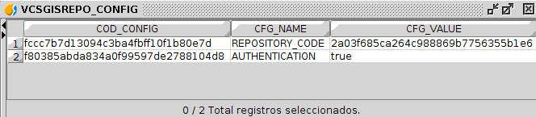
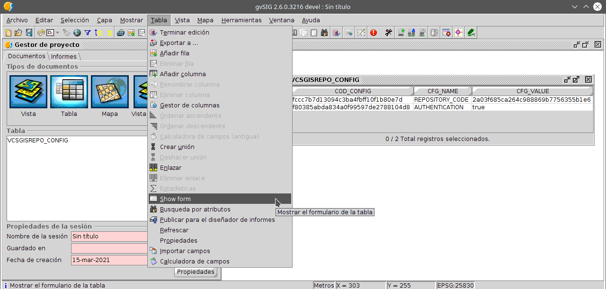
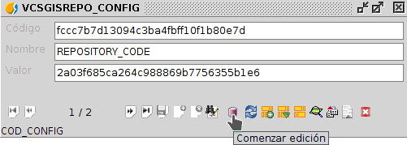
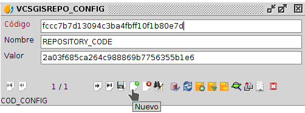
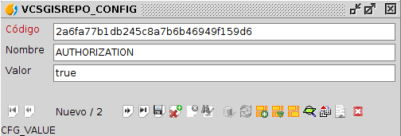
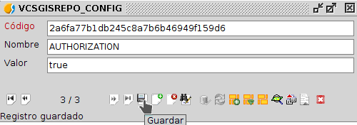
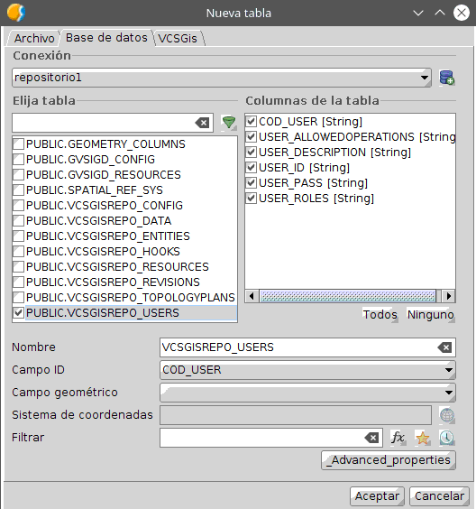
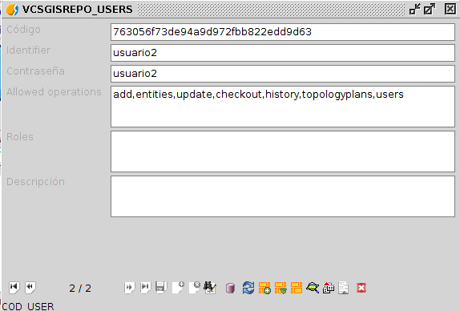
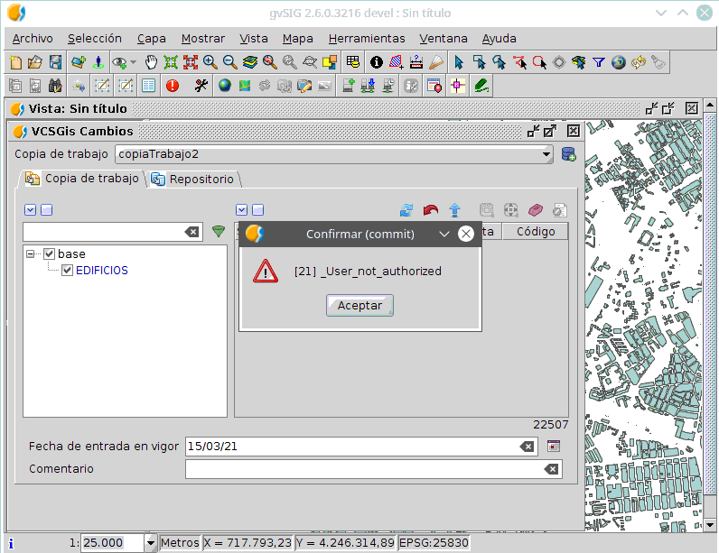

 encoding: utf-8 
 Introduccion  

**(en construccion)**

Antes de empezar con la autorización, hay que decir que que no existe un nivel de autorización básica 
o avanzada como tal sino que solo existe el nivel de autorización. Esta forma de dividir en dos apartados 
la autorización se debe a que se puede aplicar la autorización de dos maneras diferentes siendo una más 
restrictiva que la otra. La autorización básica controla las acciones que pueden realizar los diferentes usuarios,
mientras que la avanzada define en los propios datos quien y como puede trabajarlos. Por lo tanto la autorización
avanzada es más restrictiva que la básica.

En este apartado se detalla el proceso de configuración para dotar de nivel de seguridad de autorización básica a un 
repositorio. Para ello y siguiendo el hilo de la documentación de *VCSGis* se utilizan un ejemplo práctico.

Activar el proceso de autorización se realiza de igual manera que al activar el proceso de autenticación, es decir,
realizando modificaciones sobre la tabla *PUBLIC.VCSGISREPO_CONFIG*.

Para abrir dicha tabla hay que realizarlo desde el *Gestor de proyectos* situado en el menú *Mostrar* de 
*gvSIG Desktop*. El proceso de abrir una tabla es el genérico a abrir cualquier archivo, primero se 
selecciona *Tabla* como tipo de datos a abrir, se selecciona la opción de *Nuevo*, lo que habilita una 
ventana donde se tiene que seleccionar la pestaña *Base de datos*. Esa pestaña muestra en su zona superior
un desplegable donde hay que especificar la base de datos donde se encuentra la tabla. 
Una vez seleccionada la base de datos, en la lista de tablas de esta hay que marcar la tabla 
en cuestión y pulsa el botón *Aceptar*.

A continuación se muestra la ventana con la que se abre la tabla *PUBLIC.VCSGISREPO_CONFIG*.

La tabla anterior se muestra en la siguiente imagen.

Para dotar a este repositorio ejemplo de este nivel de seguridad solo hay que registrar un nuevo elemento en
dicha tabla. Lo anterior puede realizarse mediante el formulario asociado la tabla. 
Para obtener el formulario de la tabla seleccionaremos la opción *Show form* situada en el menú 
*Tabla* de *gvSIG Desktop* siempre y cuando la tabla este abierta y seleccionada.

El formulario de la tabla es el siguiente.

Una vez en el formulario se inicia la edición de la tabla para creación de un nuevo elemento. 
Este proceso se puede realizar desde el mismo desplegable que se mencionó anteriormente para obtener 
el formulario, o desde el mismo formulario utilizando el botón *Comenzar edición*.

Una vez comenzada la edición se procede a crear un nuevo elemento en la tabla.

De los diferentes campos del formulario hay que identificar los campos *nombre* y *valor*. En el primero hay que 
especificar **AUTHORIZATION** y en el segundo **true**.

Solo queda guardar los cambios en la entidad.

Y terminar la edición de la tabla.

Con lo anterior ya se dispone del nivel de seguridad autorización aplicado en el repositorio. 

Solo queda ahora configurar las acciones que pueden realizar los diferentes usuarios autenticados previamente sobre el 
repositorio ejemplo. Para hacer lo anterior hay que editar dichos usuarios en la tabla *PUBLIC.VCSGISREPO_USERS*.

Para realizar dicha edición de tabla hay que abrir la tabla y sacar el formulario asociado. La tabla se obtiene
de igual manera que la anterior al igual que su formulario. El formulario de la tabla *PUBLIC.VCSGISREPO_USERS* se 
muestra acontinuación.

El flujo de trabajo para la edición de usuarios  en el formulario anterior es el siguiente;
 * Comenzar edición.
 * Editar elemento.
 * Rellenar/cambiar campos del formulario.
 * Guardar cambios.
 * Terminar edición.

El campo en cuestión sobre el cual hay que realizar las modificaciones es el campo *acciones*.

Como se detalla anteriormente hay campos de estos elementos que son propios para cada usuario,
pero las acciones son un parámetro generales y como su propio nombre indica son las acciones 
que ese usuario puede realizar en el repositorio.
Las acciones disponibles sobre el repositorio se listan a continuación:
 * *add*. Añadir una nueva tabla al repositorio.
 * *entities*. Listar las entidades existentes en el repositorio.
 * *commit*. Subir cambios a las capas del repositorio.
 * *update*. Descargar los cambios de las capas del repositorio.
 * *checkout*. Descargar una capa del repositorio.
 * *history*. Consulta el historial de registros.
 * *topologyplan*. Descargar la tabla con los planes de topología.
 * *user*. Descargar la tabla de usuarios.

 > Un usuario sin acceso a las acciones *entities*, *topologyplan* y *user* no solo no podrá descargar dicha 
 información sino que tampoco tendrá autorización para cualquier otra acción relacionada con los elementos 
 que habilitan las acciones anteriores.

La siguiente ilustración muestra el ejemplo de un usuario editado con acciones.

El usuario se llama *usuario1*, su contraseña es *usuario1* y presenta permisos para realizar todas las acciones
posibles sobre el repositorio ejemplo.

Existe como es lógico, la posibilidad de que un usuario no presente autorización e algunas de las acciones. El
siguiente usuario ejemplo, *usuario2*, presenta todas las acciones menos la acción *commit*.

Si tras realizar cambios sobre una capa/tabla del repositorio sujeta al control de versiones este usuario
intenta subir dichos cambios locales al repositorio el sistema no lo permitirá mostrando el siguiente cuadro de
diálogo.

