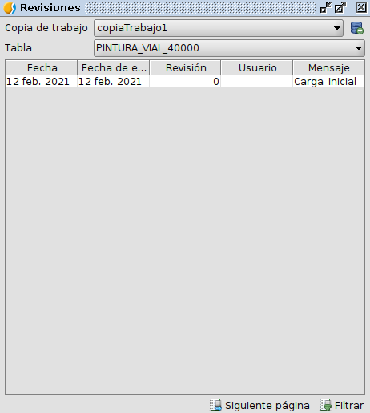

 encoding: utf-8 
 Gestión de las Revisiones  

Tal y como se menciona al inicio del documento, las revisiones o cambios que sufren los datos en un software de control de versiones presentan tanta o más importancia que los propios datos. Haciendo hincapié en la idea anterior, la herramienta software VCSGis para el control de versiones dispone de un módulo para la correcta gestión de dicha información. Para la gestión de las revisiones ir a la opción *Herramientas* del menú de gvSIG Desktop, pestaña *VCSGgis* y ejecutar *Mostrar revisiones*.

Como resultado de realizar la anterior acción se muestra la siguiente ilustración.

La ventana presenta dos elementos donde hay que seleccionar la *Copia de Trabajo* y la Tabla/Capa en cuestión. Una vez seleccionadas en la zona central de la ventana se muestran las revisiones que presenta el elemento seleccionado anteriormente en forma de tabla de datos. Para la gestión de las revisiones en dicha ventana se dispone en su zona inferior de dos iconos que permiten aumentar las revisiones presentes en la zona de visualización de esta o filtrarlas para realizar una búsqueda sobre estas.

A continuación se muestra en la siguiente composición un ejemplo de como se crea una revisión y como aparece esta en la ventana anteriormente definida.

 
