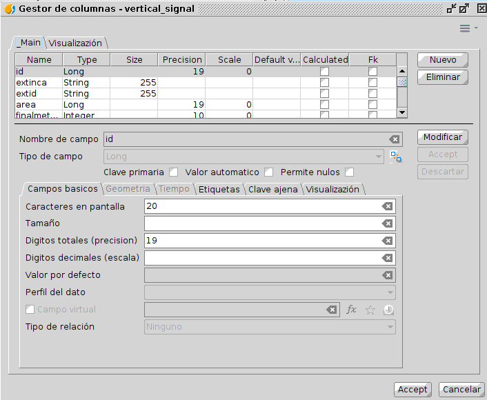
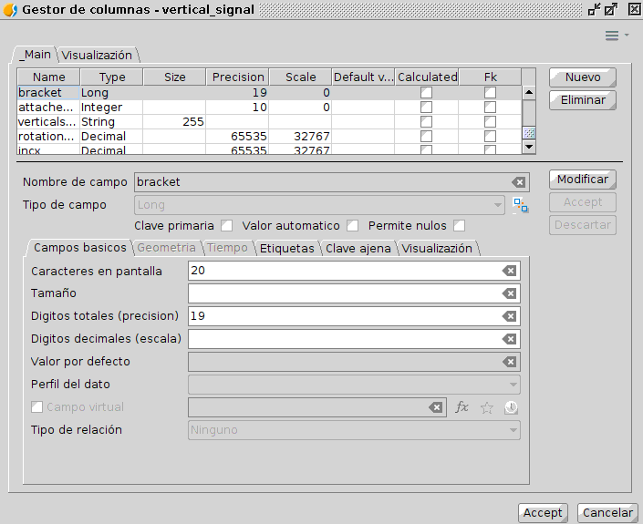
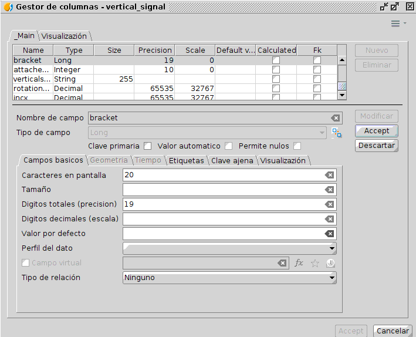
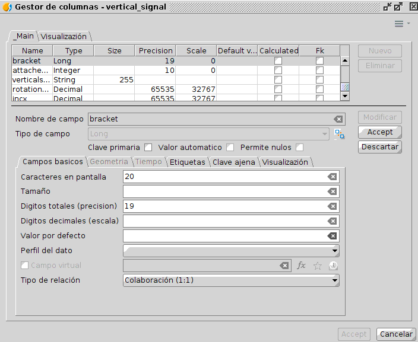
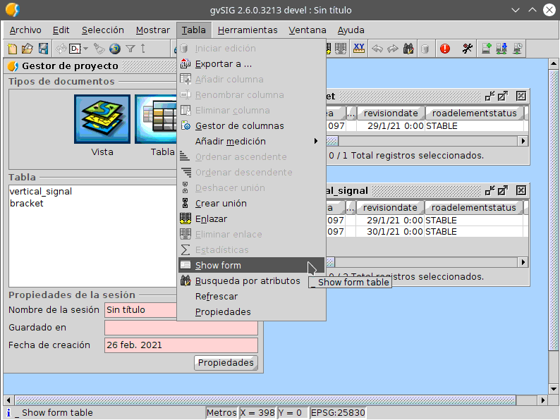
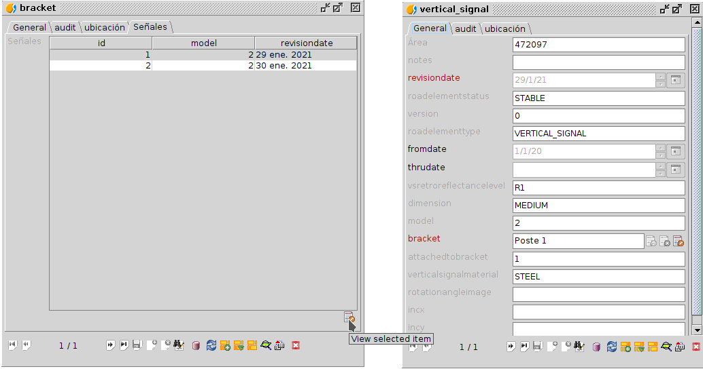

 encoding: utf-8 

 Como establecer una relacion maestro detalle entre dos tablas 

Este es el primero de una serie de documentos que permiten definir todo lo referente a las tablas de una base de datos en cuanto a relaciones entre ellas y visualización de su contenido en su correspondientes formularios.

Concretamente en este documento se especifica el proceso de definir una relación maestro detalle entre dos tablas mediante campos comunes. Esta relación puede verse desde dos puntos de vista, uno a uno o de uno a muchos. Para realizar la explicación se utilizaran las *tablas de placas* y *postes* que presentan una relación maestro detalle con las dos variantes, ya que una señal solo puede tener un poste, punto de vista de relación uno a uno, y un poste puede tener varias señales o placas, punto de vista relación uno a muchos.

 Relación desde el punto de vista uno a uno 

Para establecer la relación maestro detalle entre tablas por un campo común, en primer lugar se definirá debido a su menor grado de complejidad, la relación existente desde un punto de vista uno a uno. En primer lugar hay que *abrir las tablas* y el *gestor de columnas* asociado a estas. Para abrir las tablas hay que realizarlo desde el ***Gestor de proyectos*** situado en el ***menú Mostrar*** de *gvSIG Desktop*. El proceso de abrirlas es el genérico a abrir cualquier archivo, primero se selecciona ***Tabla*** como tipo de datos a  abrir, se selecciona la opción de ***Nuevo***, lo que habilita una ventana donde se selecciona la ***pestaña Archivo*** y tras pulsar el ***botón Añadir***, se despliega un cuadro de diálogo donde se selecciona el fichero en cuestión. Tras la selección de este la tabla se muestra en una ventana del software. La siguiente ilustración muestra las tablas con las que se va a realizar el proceso. 

La *tabla bracket o postes* tiene un único registro, mientra que la *tabla vertical_signal* presenta dos registros de dos señales, las cuales se sabe que están en el poste de la tabla anterior. Como este apartado trata la relacion desde un punto de vista uno a uno es necesario abrir el *gestor de columnas* de la tabla que presenta dicha relación, *vertical_signal*, ya que una señal esta asociada solo a un poste.

Para obtener el gestor de esta hay seleccionar la tabla en cuestión y ejecutar el comando ***Gestor de columnas*** situado en el ***menú Tabla** de *gvSIG Desktop* siempre y cuando la tabla este abierta. 

Como resultado se obtiene el siguiente gestor, *gestor de columnas* de la *tabla vertical_signal*.

Esta herramienta permite al usuario definir la estructura de datos de la tabla, así como su representación o visualización. La realización de los cambios se lleva a cabo por columnas y permite modificar estas, crear otras nuevas e incluso eliminarlas si es necesario.

Como se busca definir una relación entre las dos tablas hay que buscar el campo que la establece, en este caso *bracket*. Para establecer la relación hay que seleccionar en la ventana de *gestor de columnas* de la *tabla vertical_signal* el campo que establece la relación, campo *bracket*.

Una vez seleccionado se inicia su edición pulsando el ***botón Modificar*** situado en la zona derecha de la ventana.

Tras lo anterior se habilitan una serie de pestañas en el panel que permiten modificar todo lo referentes a los datos y su representación del citado campo. Para establecer la relación hay que modificar el contenido de dos pestañas, la ***pestaña Campos básicos*** y la ***pestaña Clave ajena***.

La configuración comienza especificando en la ***pestaña Campos básicos*** el tipo de relación que presenta el campo en cuestión.

Los tipos de relación presentes en el ultimo desplegable son:
 * **Ninguna.**
 * **Identidad (1:1).** Se utiliza para relacionar tablas que hacen referencia a un mismo objeto. Este, sea por el motivo que sea tiene distribuida la información en diferentes tablas.
 * **Colaboración (1:1).** Se utiliza para relacionar tablas por un campo o columna común. Las tablas representa información de entes diferentes que tiene relación entre si. 
 * **Composición (1:n).** Se utiliza para establecer relación entre un objeto o elemento de una tabla y varios objetos o elementos de otra, con la salvedad de que el grupo de elementos depende del objeto único. Un ejemplo fácil seria un ticket de la compra, el listado de artículos no tiene sentido si no esta asociado a un ticket.
 * **Agregado (1:n).** Se utiliza para establecer relación entre un objeto o elemento de una tabla y varios objetos o elementos de otra. Se diferencia del anterior en que el grupo de elementos puede subsistir sin necesidad del elemento único. 

En este caso concreto de establecer relación entre tablas uno a uno del ejemplo, se pasa de no tener relación alguna a *Colaboración (1:1)* ya que como se detalla en el ejemplo una señal solo esta en un poste. 

 Tras o anterior se inicia la configuración de la ***pestaña Clave ajena***.
 
 
 
Esta configuración comienza seleccionando en primer lugar si el campo es *clave ajena*, el cual lo es en el caso del ejemplo. Tras esto hay definir si dicho campo es *clave ajena de una lista cerrada o no*. En el caso de ejemplo, la tabla bracket o postes es una tabla en continuo crecimiento por lo que no esta cerrada.

 > La única diferencia entre marcar si es una lista cerrada o no es la representación de los valores de esta en el formulario de la tabla de la clave ajena, en este caso en el *formulario de vertical_signal*.

Una vez seleccionados o no los elementos anteriores hay que definir la tabla de la cual  el campo es clave ajena, así como el campo que queremos que muestre en el formulario y una formula para la representación o visualización de los datos.

Según el orden de los parámetros definidos en el párrafo anterior la *tabla* sería *bracket*, el campo sería *id* y la *formula especificada* es *‘Poste ‘ \|\| id*.

 > La expresión, *‘Poste ‘ \|\| id*, concatena la palabra *Poste* con el identificador o campo *id* de poste asociado mediante los símbolos \|\|. Esta forma de representar el dato es estética, podría indicarse unicamente el campo *id* en la barra de texto y funcionaria sin problemas.

La configuración de las pestañas se puede ver en la siguientes imagenes:

Tras lo anterior solo queda terminar la modificación del campo pulsando el botón *Aceptar* del margen derecho y terminar el proceso en el *Gestor de columnas* pulsando el botón *Aceptar* situado en la esquina inferior derecha de dicho cuadro de diálogo.

Para ver si los cambios se han realizado con éxito de manera sencilla se puede consultar el *formulario* de la tabla modificada. Para obtener el formulario de la tabla hay que ejecutar el comando ***Show form*** situado en el ***menú Tabla*** de *gvSIG Desktop* siempre y cuando la tabla este abierta. 
 

La siguiente ilustración muestra el formulario de la tabla vertical_signal antes de la relación (derecha) y tras la relación (izquierda).

Se puede aprecias que el campo *bracket* del formulario ha sufrido cambios. En el formulario inicial era un campo sin más y en el formulario resultado de las modificaciones del gestor de columnas presenta una serie de componentes o botones que indican que esta ligado a otra tabla. 

 

Esos componentes son cuatro de izquierda a derecha:
* **Caja de texto con el elemento de la otra tabla seleccionado.** En el caso del ejemplo este cumple la expresión indicada anteriormente,  ‘Poste ‘ \|\| id.
* **Icono de selección de elemento.** Este está deshabilitado si la tabla no se encuentra en edición y permite seleccionar elementos de la tabla ligada.
* **Icono borrar elemento relacionado.**  Este está deshabilitado si la tabla no se encuentra en edición.
* **Icono ver elemento relacionado.** Nos permite visualizar el elemento relacionado de la tabla ligada en el formulario de esta.

Realizado todo lo anterior se completa el proceso de ligar una tabla con otra mediante una relación uno a uno mediante un campo común. 

 Relación desde el punto de vista uno a varios  

Tras completar el apartado anterior y siguiendo el ejemplo, se deduce que es necesario establecer la otra mitad de la relación, es decir la existente desde el punto de vistade los postes, relación de un elemento a varios de otra tabla. De esta forma tendríamos completamente definida la relación entre las dos tablas en un sentido y otro.

Existen dos casos bien diferenciados a la hora de definir relaciones entre tablas. El primero de estos dos casos se basa en la existencia de campo comunes que las relacionan. Un ejemplo de este es el realizado en el apartado anterior. El segundo caso se da cuando una de las tabla no presenta un campo como tal que indique los elementos de la otra tabla, pero esa otra tabla si lo presenta. Un ejemplo de esto se da en la *tabla bracket*, la cual no presenta un campo con las señales que dispone, pero la *tabla vertical_signal* si dispone un campo bracket. Para establecer la relación de señales que presenta un poste por lo tanto se tendrán que crear *campos nuevos* en la *tabla bracket*.

El proceso de relacionar las tablas es básicamente el mismo a excepción de la creación de nuevos campos o columnas y se basa en realizar modificaciones sobre el cuadro de diálogo *Gestor de columnas* de la *tabla bracket, postes*.

Una vez en el *Gestor de columnas* de la *tabla bracket* se inicia el proceso con la creación de un nuevo campo. Para realizar esto hay que pulsar el ***botón Nuevo*** situado en el margen derecho de la ventana.

Como resultado de la ejecución y tal y como se muestra en la imagen anterior se crea un campo por defecto llamado *Campo1*, de tipo *String*, *tamaño 50*, *tipo de relación igual a ninguno*…

Tras la creación de este, se ha puesto la capa en edición de manera automática y se permite cambiar los parámetros que lo definen. De modo que, siguiendo el ejemplo, el nuevo campo tiene que llamarse *Señales*, ser de tipo *lista*, presentar un *tipo de relación de agregado (1:n)* y además ser un *campo calculado* con la expresión *SELECT * FROM vertical_signal WHERE vertical_signal.bracket=id;*

 > La expresión ,SELECT * FROM vertical_signal WHERE vertical_signal.bracket=id;, selecciona todos los elementos de la tabla vertical_signal donde el valor de su columna bracket coincida con el valor del campo id de la tabla bracket.

Todos los valores anteriores pueden detallarse en la ***pestaña Campos básicos***. Concretamente el nombre *Señales* se puede definir en el ***cuadro de texto Nombre de campo***, el tipo de campo se detalla en el ***desplegable Tipo de Campo o el icono adyacente a este*** que ofrece una mayor colección de tipo de datos. El tipo de relación se detalla en el ultimo ***desplegable de la pestaña llamado Tipo de relación***. Por último el que sea un campo calculado se especifica seleccionando la ***opción Campo virtual*** situada sobre el desplegable anterior y la formula se introduce en el cuadro adyacente a ese check. La fórmula puede introducirse de manera manual o mediante el evaluador de expresiones.

Como resultado de la creación y modificación del nuevo campo señales, la ventana del Gestor de columnas presenta este aspecto.

Tras modificar lo anterior aceptamos guardar los cambios sobre el campo señales lo cual hace que este presente los parámetros correctos en la lista de campos del Gestor de columnas.

Una vez eso solo queda terminar los procesos en el *Gestor de columnas* pulsando el ***botón Aceptar*** situado en la esquina inferior derecha de dicha ventana.

Para ver si la relación se ha llevado a cabo hay que visualizar la *tabla bracket* o el *formulario asociado a ella*. En los dos elementos debe aparecer un nuevo campo llamado *Señales* relleno con una lista de valores que identifican las señales que presenta dicho poste.

De este modo la relación se ha realizado con éxito pero la visualización del grupo de elementos relacionados no es la deseada. Para mejorar dicha visualización hay que acudir de nuevo al *Gestor de columnas* de la *tabla de postes, bracket*, seleccionar la columna *Señales* e iniciar la edición pulsando el ***botón Modificar***.

En esta ocasión hay que configurar dos pestañas, la ***pestaña Visualización*** y la ***pestaña Etiquetas***.

En la ***pestaña Visualización*** se especifica la *creación de un grupo* al cual llamamos *Señales*.

La creación de un grupo hace que el contenido de esa columna pase a ser una *pestaña nueva en el formulario*, es decir se encuentre aislada del resto de la información.

Con respecto a la configuración de la ***pestaña Etiquetas*** se establece la forma con la que se van a representar los elementos de la columna *Señales*. Para realizar la configuración hay que añadir al panel de dicha pestaña la siguiente serie de parámetros mediante el ***botón Añadir*** y ***Actualizar***. Esos parámetros son:
 * ***DAL.RelatedFeatures.Table***. Especifica la tabla de donde va obtener los valores a representar para cada elemento de la columna señales.
 * ***DAL.RelatedFeatures.Unique.Field.Name***. Detalla el identificador único de la tabla anterior.
 * ***DAL.RelatedFeatures.Columns***. Columnas de la tabla que guarda información de los elementos de la lista que se van a mostrar para los diferentes elementos de esta que se dan tras la relación. Especificar que el nombre de las columnas tiene que ir separado por dos puntos (‘:’).
 * ***dynform.resizeweight***. Permite ajustar el tamaño de la zona donde se muestran el grupo d e elementos.

En el caso concreto del ejemplo que se esta realizando los valores de los parámetros anteriores son;

 * DAL.RelatedFeatures.Table → *vertical_signal*
 * DAL.RelatedFeatures.Unique.Field.Name. → *id*
 * DAL.RelatedFeatures.Columns. → *id:model:revisiondate*
 * dynform.resizeweight. → *10*

Una vez terminado lo anterior se termina la edición de la columna pulsando el ***botón Aceptar*** del margen derecho y terminar el proceso en el *Gestor de columnas* pulsando el ***botón Aceptar*** situado en la esquina inferior derecha de dicha ventana.

Como resultado de lo anterior podemos ver que el formulario de la *tabla de postes, bracket* ha cambiado con respecto al anterior.  Tras las anteriores modificaciones realizadas en el *Gestor de columnas* este ahora presenta en su margen superior una pestaña llamada *Señales*, la cual almacena las placas de señales que tiene el poste en cuestión mostrando el identificador, modelo y fecha de revisión de cada señal.

Para ver la información de cada señal en su formulario correspondiente solo hay que seleccionarla y pulsar el icono que hay bajo la lista.

