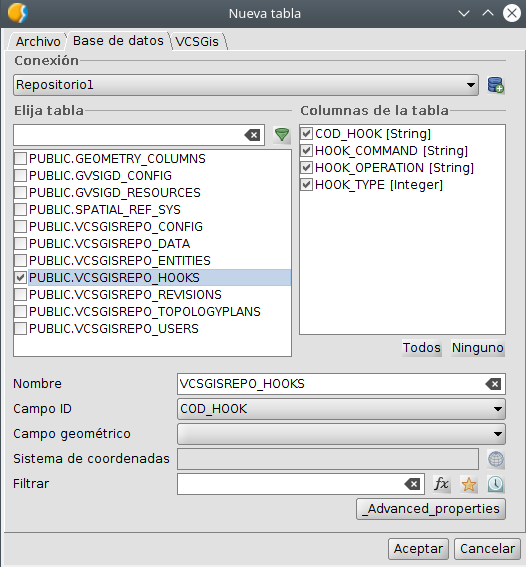
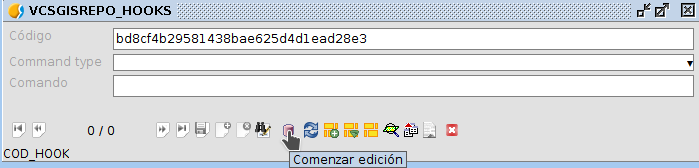
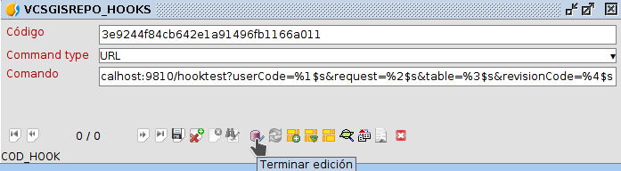
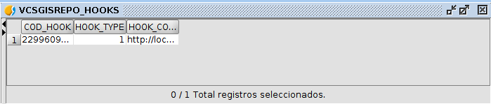

 encoding: utf-8 
 Notificaciones del repositorio  

Un repositorio de VCSGis puede ser configurado para que cada vez que se den modificaciones en él este realice una notificación a un servicio externo. Un ejemplo de esto se da cuando un usuario realiza un "commit" contra el repositorio, VCSGis enviará una notificación indicando que el usuario en cuestión a realizado una operación de "commit" en una determinada tabla de repositorio, así como en que versión ha quedado dicha tabla. Normalmente las notificaciones se realizaran ha través de invocar a un servicio web mediante una llamada GET.

Para que se pueden llevar a cabo estas notificaciones hay que configurar en el repositorio un "hook". Para configurarlo debemos crear una entrada nueva en la tabla VCSGISREPO_HOOK, indicando el modo de la notificación y la URL del servicio que ha de usarse para realizar dicha notificación.

Antes de enviar la notificación a la URL indicada, se personalizará esta con cuatro parámetros, todos ellos opcionales. Estos parámetros son:

* 1. Código del usuario que ha realizado la operación.
* 2. Operación realizada.
* 3. Nombre de tabla o entidad sobre la que se ha realizado la modificación.
* 4. Código de revisión en el que ha quedado la tabla implicada en el repositorio.

Un ejemplo de URL podría ser:

  http://localhost:9810/hooktest?userCode=%1$s&request=%2$s&table=%3$s&revisionCode=%4$s

En esta URL se incorporaran los cuatro parámetros que se pueden establecer, estando referenciados como %1$s, %2$s, %3$s y %4$s. El mecanismo de envio de notificaciones sustituirá estos valores por el correspondiente parámetro. No es preciso indicar los cuatro parámetros en la URL, de hecho no es preciso indicar ninguno de ellos, ya que todos son opcionales tal y como se dijo con anterioridad. Así mismo, en el ejemplo, estos valores se asignan a los parámetros de la URL "userCode", "request", "table" y "revisionCode", pero puede especificarse cualquier otro nombre para estos parámetros, adaptándose así a las necesidades del servicio.

Cuando se realiza una operación contra el repositorio, se añade a la cola una petición de envio de notificación, resolviéndose dicha operación inmediatamente, sin esperar a que esta sea notificada a los servicios que estén registrados para ello. Los notificaciones serán enviadas a los distintos servicios configurados por el orden en el que se han realizado las operaciones.

Siempre que se configure el repositorio para enviar una notificación, deberemos tener en cuenta el rendimiento de este. El tiempo de envio de notificaciones a otros servicios puede verse afectado si existen servicios que reciben notificaciones caídas o que no responden en un tiempo razonable. A la hora de implementar un servicio de recepción de notificaciones tenemos que tener en cuenta que este no debe hacer operaciones "pesadas" durante el procesamiento de la notificación. Es recomendable que el servicio las añade a la cola y se vayan procesando en una tarea o hilo de ejecución independiente.

Un aspecto importante a destacar es que, en la notificación nunca se envían los registros involucrados en la operación que generó esta. En caso de que se requieran, sera responsabilidad del servicio que la reciba determinar en que revisión se encuentran los datos que tiene de esa tabla, y si no están en la correcta, solicitar al servidor VCSGis que le envie los datos de esa tabla que han cambiado desde la revisión en la que están los suyos hasta el HEAD o la revisión indicada en la notificación.

Y... **¿ como registramos en el servidor VCSGis que queremos que nos notifique cuando se realizan operacion contra el ?**

Para registrar una nueva notificación, deberemos tener acceso a la base de datos en la que se encuentra el repositorio. Si estamos usando *gvSIG Desktop*, crearemos una conexión a esa base de datos en caso de no tenerla y cargaremos la tabla **VCSGISREPO_HOOKS** como una tabla del proyecto gracias al gestor de proyectos.

La carga de la capa se realiza seleccionando la opción *Tabla* y posteriormente el boton *Nuevo*.Tras eso se selecciona la opción *Base de datos* en las pestañas de selección de fuente de datos situados en la zona superior de la ventana. Una vez allí, se selecciona la conexión con el repositorio y se carga la tabla **VCSGISREPO_HOOKS**.

Como resultado se muestra la tabla **VCSGISREPO_HOOKS**, la cual no presenta ningún registro.

Una vez visualizada la tabla se procede a mostrar el formulado asociado a esta. Una de las múltiples formas de obtener esta herramienta se realiza al ejecutar el comando *Show Form* situado en la pestaña *Tabla* de gvSIG Desktop.

Una vez diponemos del formulario de la tabla hay que poner poner en edición esta para agregar un nuevo registro. Este proceso se puede realizar desde el mismo desplegable que se mencionó anteriormente para obtener el formulario, o desde el mismo formulario utilizando el botón *Comenzar edición*.

Una vez visualizado el formulario y con la tabla en edición, ver siguiente ilustración, se procede a crear un nuevo registro pulsando el icono *Nuevo* situado en la zona inferior del formulario e indicado en la imagen siguiente.

Tras lo anterior se rellena los campos del formulario. El primer campo, *Código*, se rellena de manera automática con un identificador único. El segundo campo, *Command Type* dispone de las opciones *URL* y *Shell*, seleccionando la primera. El tercer campo, *Comando*, permite almacenar el objeto en concreto especificado en el campo anterior, en nuestro caso la URL del ejemplo. Tras terminar de completar e formulario solo queda guardar los cambios con el icono *Guardar* presente en la zona inferior de la ventana y especificado en la próxima imagen.

Una vez realizado lo anterior solo queda terminar la edición de la tabla. Para ello hay que ir a la pestaña *Tabla* de *gvSIG Desktop* y ejecutar el comando *Terminar edición* o terminar la edición desde el mismo formulario.

Realizado lo anterior ya podemos ver que la tabla **VCSGISREPO_HOOKS** presenta un registro de notificación.

