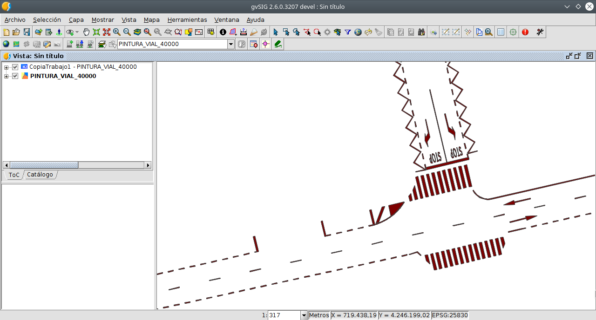
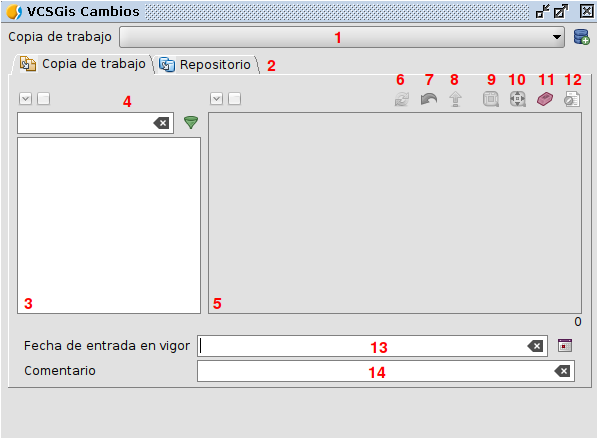
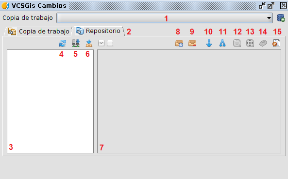

 encoding: utf-8 
 Añadir una capa al repositorio  

Tras cerciorarnos de la existencia de un repositorio y de una copia de trabajo se procede a actualizar este con nueva información. Para realizarlo hay que cumplir dos pasos.

El paso 1 consiste en cargar dicha nueva información o capa en la vista. El segundo paso se basa en ir a la opción *Herramientas* del menú de gvSIG Desktop, pestaña *VCSGgis* y pestaña *Añadir a la copia de trabajo*.

Tras pulsar el comando *Añadir a la copia de trabajo* se desplegá la ventana siguiente donde se selecciona la copia de trabajo donde queremos añadir la capa, la estructura de carpetas actual de gvSIG donde se selecciona la información a añadir y una serie de opciones. 

Entre las opciones destaca *Añadir esa capa a la vista*, opción recomendada para iniciar el proceso de edición utilizando el control de versiones. Hay que hacer incapie en la idea anterior, la capa añadida recientemente es sobre la que hay que trabajar ya que es la que tiene un control de versiones asociado, la capa inicial usada para introducir el dato puede eliminarse de la vista ya que los cambios sobre ella no se registan en VCSGis.

Las opciones restantes son nombre, campo para etiquetas, etiqueta y categoría. Estas opciones permiten respectivamente renombrar la capa en el árbol de la vista, seleccionar que campo queremos que sea representado como campo de etiquetas respectivamente, crear una etiqueta referida a esa capa y asignar la capa a una categoría definida por el usuario.

El proceso de añadir la nueva capa al repositorio termina cuando tras realizar la carga de información anterior se ejecuta la el comando *Mostrar cambios* situado en la pestaña *VCSGis* dentro de la opción *Herramientas* de del software.

La ejecución de lo anterior genera la siguiente ventana.

La ventana anterior o ventana *Mostrar cambios* es una de las ventanas más importante de VCSGis y es la encargada como su propio nombre indica de mostrar los cambios entre la copia de trabajo actual y el repositorio. Los cambios entre información se detectan seleccionando la copia de trabajo en cuestión y mediante la gestión de las pestañas *Local* y *Remoto*. Al seleccionar la pestaña ***Local*** se muestran los ***cambios existentes en la copia de trabajo frente al repositorio***. Si por el contrario se selecciona la opción ***Remoto*** se muestran los ***cambios del repositorio frente a la copia de trabajo***. Además de las pestañas, la ventana permite identificar la *Fecha de entrada en vigor* así como un apartado *Comentarios* asociados a los cambios que se van a enviar al repositorio. 

Los componentes seleccionada la opción *Local* de esta se listan a continuación:

 1. Desplegable para selección de la *Copia de trabajo* sobre la que ver los cambios.
 2. Pestañas Local/Remoto.
 3. Área de visualización de capas presentes en la copia local. Dependiendo del color que presente en esta zona, las capas presentarán cambios locales o no.
 4. Elementos de filtrado para realizar búsquedas de capas.
 5. Área de visualización de cambios.
 6. Botón de refrescar el área de visualización.
 7. Botón revert. Esta función permite deshacer los cambios locales presentes en el área de visualización de cambios.
 8. Botón para enviar o *confirmar* los cambios locales al repositorio (commit).
 9. Botón que marca la geometría con cambios locales.
 10. Botón que centra la vista en la geometría con cambios locales.
 11. Botón que elimina la marca de la geometría con cambios locales, generada con el componente 6.
 12. Botón que muestra un folmulario con los datos del registro seleccionado.
 13. Campo para indicar la fecha de entrada en vigor de los cambios que van a ser enviados al repositorio.
 14. Campo para introducir un comentario a los cambios que van a ser enviados al repositorio.

Los componentes seleccionada la opción *Remoto* de esta se listan a continuación:

 1. Desplegable para selección de la *Copia de trabajo* sobre la que ver los cambios.
 2. Pestañas Local/Remoto.
 3. Área con lista de capas de la *Copia de trabajo*.
 4. Botón de refrescar la lista de capas de la *Copia de trabajo*.
 5. Botón que permite hacer de manera directa una copia local (checkout) de la capa seleccionada.
 6. Botón para descargar los cambios que han habido en la capa seleccionada en el repositorio desde la ultima vez que se actualizó esta en la *Copia de trabajo*. Esta operacion puede ser pesada dependiendo de la cantidad de cambios que hayan en el repositorio desde la ultima actualización de la *Copia de trabajo*. 
 7. Área de visualización de cambios. Muestra los cambios que han habido en el repositorio en relacion a las capas de la *Copia de trabajo*.
 8. Actualiza el área de visualización de cambios, releyendo estos de la informacion almacenada en la *Copia de trabajo*. No accede al repositorio para actualizarlos.
 9. Elimina la lista de cambios de la *Copia de trabajo*. El usuario debera descargarlos de nuevo del repositorio en caso de que desee verlos.
 10. Botón *Update*. Se actualizaran las tablas locales,*Copia de trabajo*, con los cambios del repositorio. Si hay cambios locales se perderán. Esta opción no esta disponible por defecto si existen conflictos entre los cambios del repositorio y los cambios realizados en la *Copia de trabajo*. En el caso que existiendo conflictos se busque prevalecer la información remota frente a la local, se tendria que marcar todos los cambios del repositorio, proceso que habilita dicho botón en la ventana *Mostrar cambios*.
 11. Botón *Merge*. Se mezclan o fusionan los cambios de la capa del usuario de la *Copia de trabajo* con los cambios del repositorio. El proceso es simple, los cambios remotos que no tengan conflicto, cambios de color diferente a rojo, se actualizan en la *Copia de trabajo*, al igual que los cambios con conflictos, cambios de color rojo, con el check seleccionado. Marcar el check de los cambios en conflicto implica que prevalecerán los cambios del repositorio para esos determinados elementos frente a los existentes en la *Copia de trabajo* o capa local. Si lo que se busca es mezclar la capa local y remota asegurando que los cambios locales sean los finales, no hay que marcar ningún cambio en conflicto y realizar la operación *Merge*. Esta operación solo estará activa si se han detectado conflictos entre la *Copia de trabajo* y el repositorio.
 12. Botón que marca la geometría con cambios en el repositorio.
 13. Botón que centra la vista en la geometría con cambios en el repositorio.
 14. Botón que elimina la marca de la geometría con cambios en el repositorio, generada con el componente 12.
 15. Botón que muestra un folmulario con los datos del registro seleccionado.

Esta opción de la ventana se explicará con mayor detalle en los apartados siguientes mediante ejemplos.

Volviendo al caso en cuestión tras ejecutar el comando *Mostrar cambios* y al pulsar la opción *Local* en el área destinada a estos aparecen registros correspondientes a los elementos de la capa a añadir, ver siguiente imagen. Esto se debe a que hay diferencias entre la copia de trabajo y el repositorio, presentando la copia de trabajo una serie de nuevos elementos, una capa, que el repositorio carece. El proceso de añadir una nueva capa al repositorio finaliza si seleccionamos esos registros y pulsamos el botón que realiza un *commit*, componente 8 de la ventana. Con esa acción el repositorio se actualiza con la información de la copia de trabajo y tendría por tanto la nueva capa a su disposición.

A modo de comprobación tras lo anterior si se selecciona la pestaña *Local* y se pulsa el botón de actualizar o refrescar área de visualización (componente 6 de la ventana), esta aparecerá vacía.

