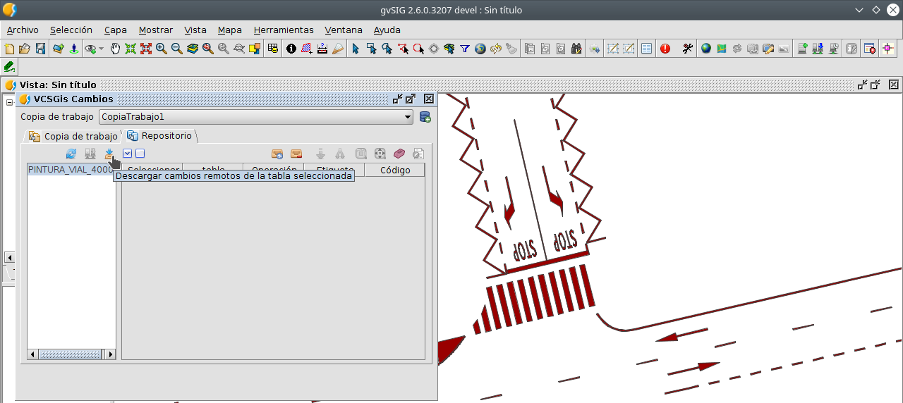

 encoding: utf-8 
 Actualizar la copia de trabajo  

Para actualizar la copia de trabajo hay que ejecutar el comando *Mostrar cambios* y una vez en la ventana con el mismo nombre seleccionar la pestaña *Remoto*; quedando la ventana en cuestión como en la siguiente figura.

Si no existen cambios en el repositorio con respecto a la copia de trabajo, las capas de la lista de capas de la *Copia de trabajo* apareceran con una tipografía sin negrita en el componente 3 de la ventana (área con lista de capas de la *Copia de trabajo*) indicando que la *Copia de trabajo* está actualizada; pero si existen cambios, estas aparecerán en negrita estando la copia desactualizada.

Para actualizarla hay que seleccionar la capa en negrita y pulsar el botón para descargar los cambios o diferencias del repositorio frente a la *Copia de trabajo*, componente 5 de la ventana. 

La acción anterior provocará que los cambios se descarguen del repositorio y se muestren en el área de visualización de cambios, componente  6. Estos cambios aun no se habrán aplicado sobre las tablas del usuario. Para realizar esto deberán usarse los botones de **actualizar** (Update) o **mezclar** (Merge) cambios en la *Copia de trabajo*, componentes 10 y 11 de la ventana.

!!! note 
    ***Actualizar (Update); Se actualizaran las tablas locales con los cambios del repositorio. Si hay cambios locales se perderán.***
    ***Mezclar (Merge); Se mantendrán los cambios remotos para los registros seleccionados,y los cambios locales para los registros no seleccionados.***

