Editor de Scripts: Funcionalidades
==================================

El módulo de Scripting dispone de una serie de herramientas para facilitar el desarrollo en gvSIG. Estas herramientas vienen en un plugin denominado "Scripting Composer Tools" que puede ser descargado desde el Administrador de Complementos. Una vez instalado, apareceran nuevos iconos y menus en el Editor de Scripts.

Búsqueda
++++++++

Atajo: Control + F
Atajo: Control + Alt + F

La búsqueda permite encontrar cadenas de texto en el código que esté abierto. Hay dos búsquedas, una que aparece como una ventana emergente, otra que aparece integrada en el IDE.

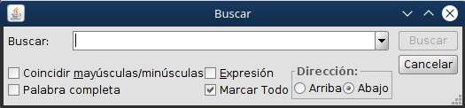

Nota: La búsqueda integrada permite realizar la búsqueda de forma iterativa, es decir, cuando llega al final de los valores encontrados, vuelve a empezar por los del inicio.

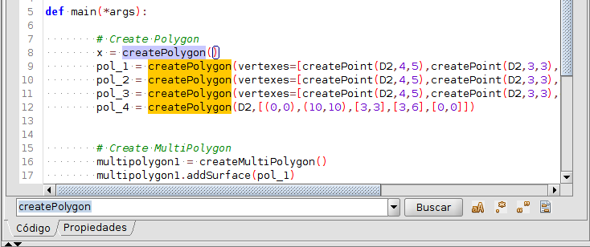

Reemplazar
++++++++++
Atajo: Control + H

Permite remplazar cadenas de texto en el código.

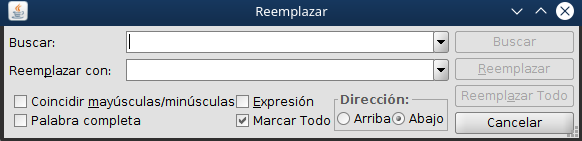

Autocompletado
++++++++++++++

Si estamos escribiendo código y presionamos Control+Espacio, nos aparecerá un menú emergente con toda una serie de clases y métodos. Este autocompletado es masivo y puede recomendar métodos que no estén disponibles para esa clase. Sin embargo, cuando buscamos un método y no recordamos exáctamente su nombre, viene muy bien para buscarlo.

Navegador de código
+++++++++++++++++++

Atajo: Control + O

Navegador de código que ayudará a visualizar las diferentes partes del código. Señalará: imports, clases, métodos y funciones.

Utilizado el atajo del teclado aparecerá como ventana emergente.

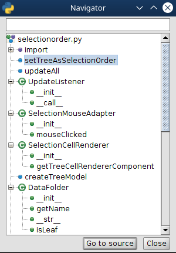

Si se accede mediante el menú Mostrar -> Code Navigator aparecerá integrado.

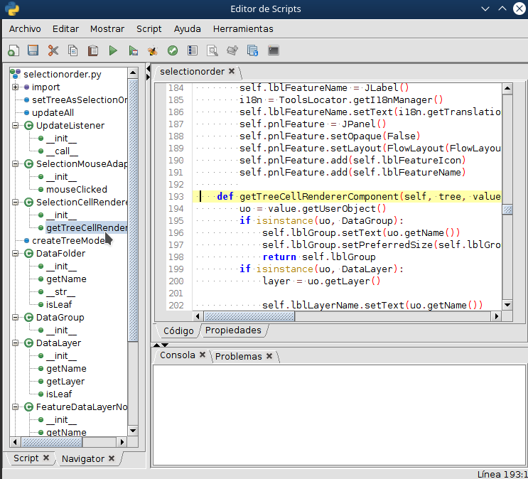

Buscar referencias
+++++++++++++++++++

Atajo: Control + R

Esta herramienta es una herramienta de busqueda avanzada. Permite buscar no solo texto en un fichero, sino en diferentes carpetas o proyectos. Además también permite buscar clases, métodos o funciones definidas con ese nombre, realizando así una búsqueda inteligente sobre el código.

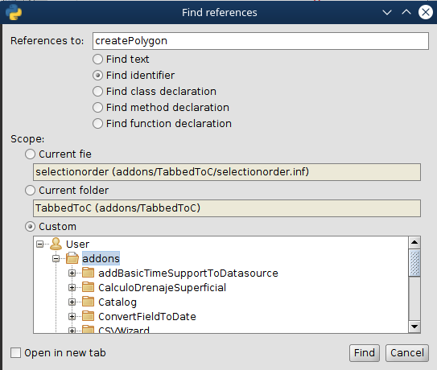

Buscador de clases
++++++++++++++++++

Atajo: Control + Mayusculas + O

Nota: Esta herramienta necesita que los Javadocs estén abiertos para un correcto funcionamiento.

Selector de fuente
++++++++++++++++++

Permite la modificación de la fuente en el editor.

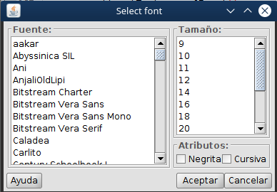

Markdown preview
++++++++++++++++
Ventana de previsualización de coódigo Markdown. Permite visualizar el código Markdown en un fichero .md como un HTML. Muy útil si queremos publicar en Github ficheros de ayuda como el README.md, el cual es por defecto la ayuda que muestra en los repositorios.

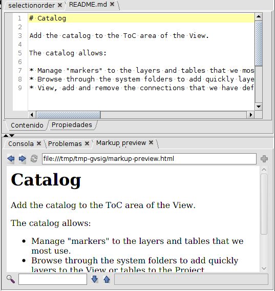

Shell Python
++++++++++++

Consola de Jython que aparecerá integrada en el IDE. Permite realizar todo tipo de operaciones así como interactuar con las librerías de Java.

.. figure::  images/ide_consola_jython.png
   :align:   center

Javadocs
++++++++
Herramienta principal de ayuda del módulo de programación.

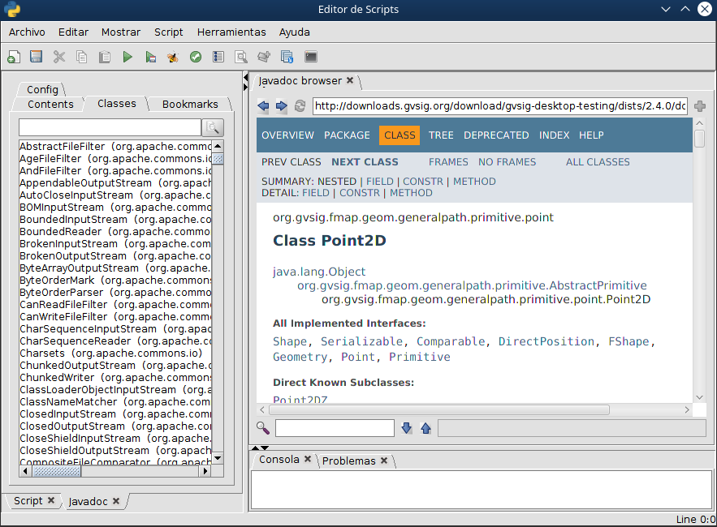

Empaquetador de Scripts
+++++++++++++++++++++++

Una vez hemos creado un script en su propia carpeta con todo lo necesario, podemos generar un paquete de gvSIG ``.gvspkg`` para enviarlo o subirlo. Con este paquete podremos **realizar la instalación del script desde el Administrador de Complementos**. Su uso es muy intuitivo.

La herramienta se encuentra en el Scripting Componser, en el menú :menuselection:`Herramientas --> Paquete de script`.

Seleccionamos la carpeta que contiene nuestra extensión:

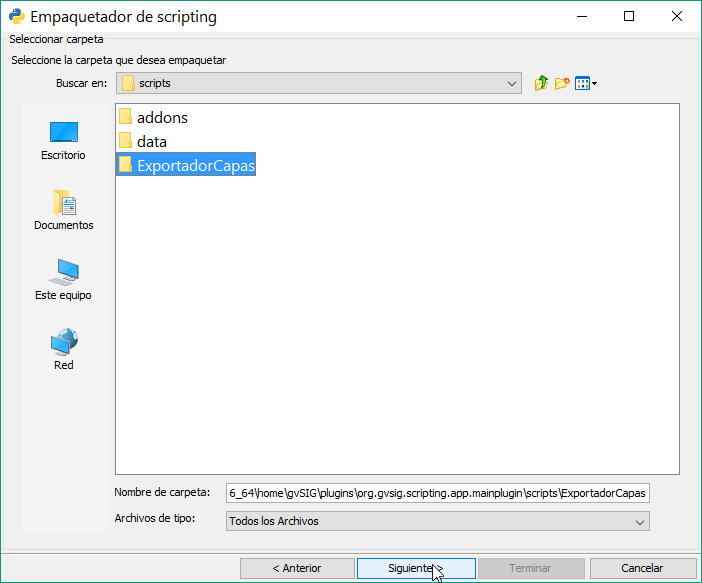

Establecemos las propiedades del paquete:

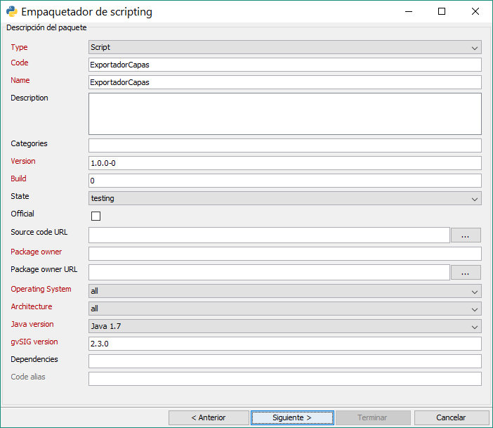

Las opciones de salida:

La ruta será similar a esta: ``gvSIG-desktop-2.3.0-2441-RC2-win-x86_64\install\gvSIG-desktop-2.3.0-ExportadorCapas-1.0.0-0-testing-all-all-j1_7.gvspkg``.

.. figure::  images/empaquetador_3.png
   :align:   center

Y terminado, ya aprecerá nuestro extensión en formato ``.gvspkg`` para poderse instalar desde el Administrador de Complementos

.. figure::  images/empaquetador_4.png
   :align:   center

Abeille
+++++++

Herramienta para la generación de interfaces visuales. Dispone de un módulo entero dedicado a su uso.

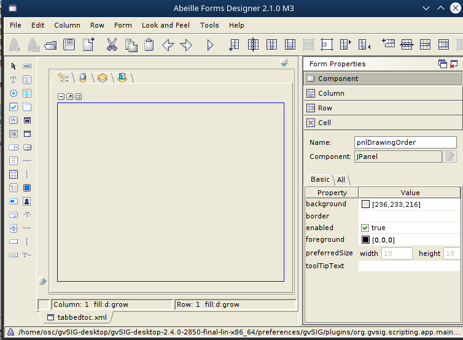

Lint
++++

Realiza una análisis en profundidad en busca de  errores. Estos errores pueden no ser solo errores de programación, sino también errores de estilo. Para ejecutarlo se debe de tener abierto el script a analizar y lanzar Lint a través del botón en la barra de acciones.

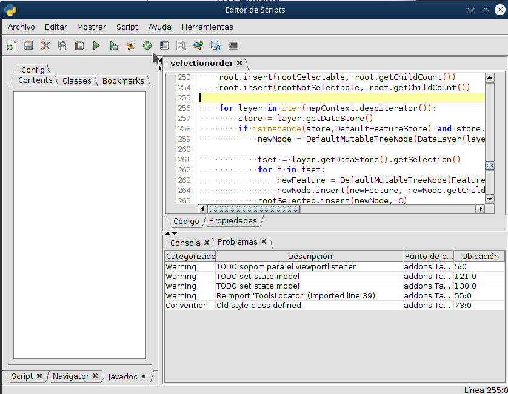

Thread list
+++++++++++

Esta herramienta mostrará un listado de los threads en ejecución. Permitirá cerrar threads que se hallan quedado colgados sin finalizar durante el desarrollo. Para utilizarlo, solo hay que seleccionar el thread a finalizar, y presionar "Interrupt". Si es un script realizado por nosotros, aparecerá con el nombre del script para una fácil localización.

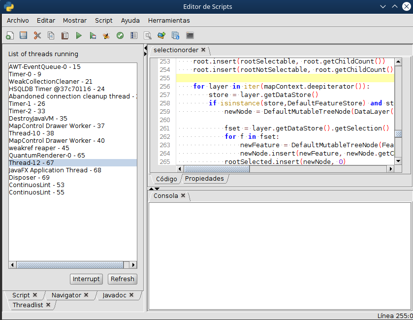

Load layer
++++++++++

En el desarrollo de algunos plugins se dispone de carpeta con datos, como capas shape, raster, etc. Para agregar estas capas había que irse a la herramienta común de la Vista para agregarlas. Ahora es posible agregarlas directamente desde la IDE.

Para ello solo es necesario seleccionar la capa a agregrar en la carpeta de proyectos y presionar sobre botón de "Añadir capa".

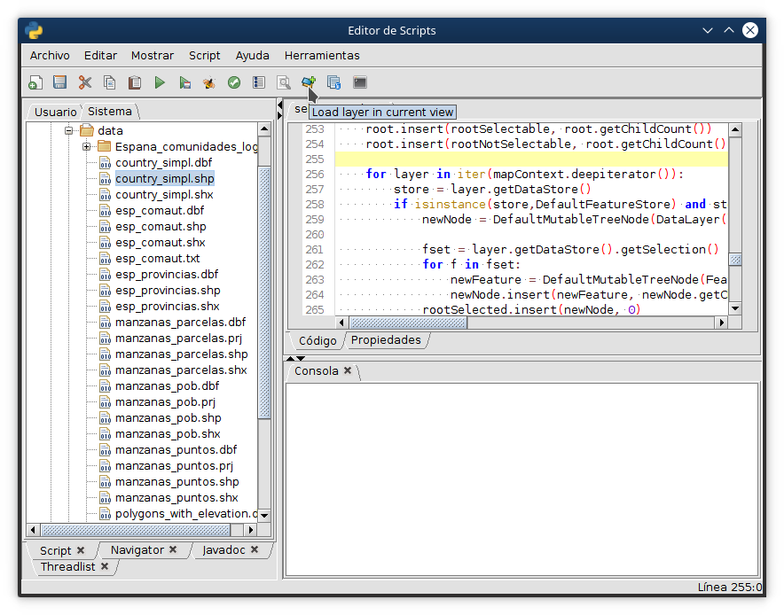

Fix imports
+++++++++++

Atajo: Control + Mayusculas + I

Herramienta que auto añade los imports necesarios para la ejecución del código. Estos imports pueden ser de librerías de Java, librerías de gvSIG o incluso de otras clases que se encuentren en el mismo módulo programado en Jython. Si algún import es el equivocado de otra librería, se pueden presionar uno a uno y modificar la librería desde la que importarlos. Al aceptar, se agregarán todos al inicio del script.

Filesystem Explorer
+++++++++++++++++++

Si deseas acceder con el explorer a la carpeta de un plugin, solo tienes que seleccionar la carpeta en la lista de proyectos e ir a: Herramientas --> Filysystem Explorer

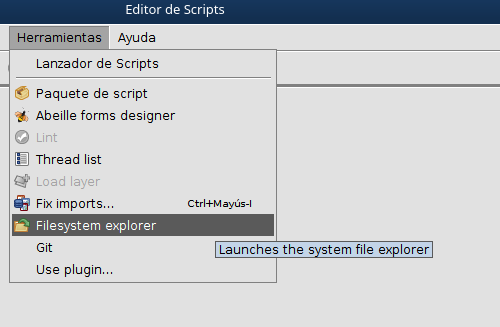

Use plugin
++++++++++

En algunos casos, las librerías utilizadas en los plugins que estemos desarrollando tengan dependencias de otras librerías de gvSIG que se encuentran en algún plugin en concreto. Para asegurar que este plugin está cargado es necesario indicarlo mediante unas lineas de código que forzaran la carga de estos plugins. Estas líneas se obtendrán a través de esta herramienta. Se seleccionará el plugin que queremos utilizar y copiaremos las líneas que nos da al inicio del script en desarrollo.

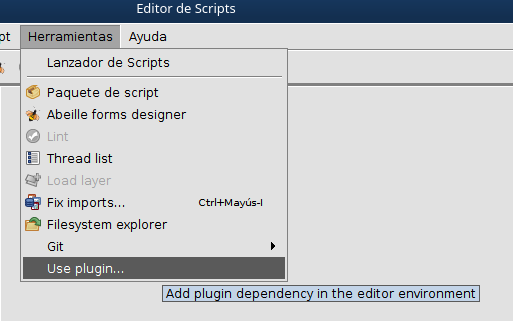
   
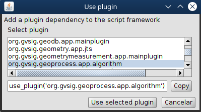

Git
+++
La herramienta de Git es una herramienta de control de versiones. Existe un `artículo sobre git`_ publicado en el blog sobre su uso.

.. _artículo sobre git: https://blog.gvsig.org/2018/04/13/scripting-en-gvsig-integracion-con-git/

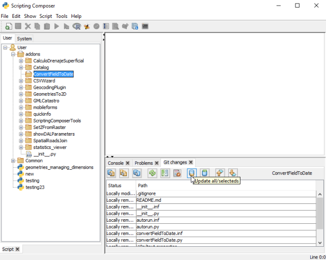

R
+
En el menú aparecerá un icono que lanzará una consola de R en caso de que esté instalado el plugin de R.

.. figure::  images/ide_r.png
   :align:   center
