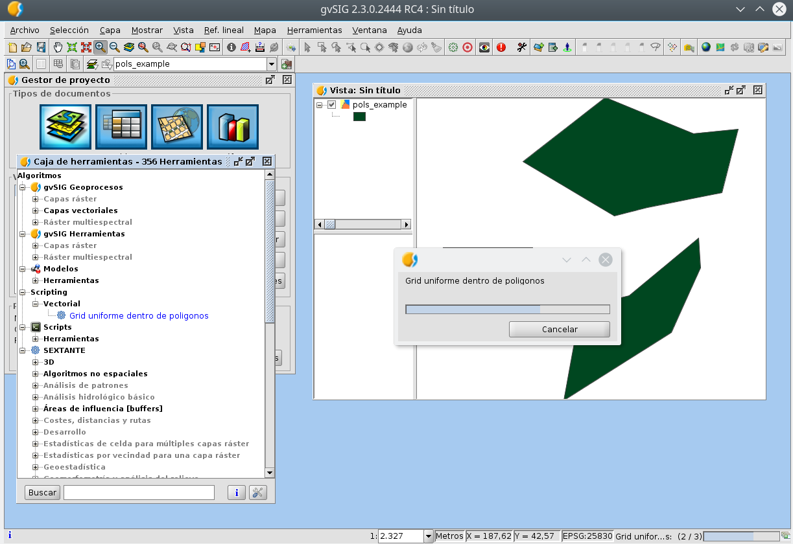

.. _label-geoprocesos:

Geoprocesos
===========

Librería Toolbox
----------------

Esta clase nos ayudará a generar nuestros geoprocesos para insertarlos en la Caja de Herramientas 
y permitiéndonos algunos extras que iremos explicando.

La librería Toolbox se encuentra dentro de ``gvsig.libs.toolbox`` y la podemos importar de forma similar::

    from gvsig.libs.toolbox import *

La clase principal que utilizaremos será ``ToolboxProcess`` que nos ayudará a extender de ella nuestro 
proceso, con todo lo necesario para gestionarlo y que funcione correctamente dentro de la Caja de Herramientas.

Las constantes de las que consta esta librería::

    SHAPE_TYPE_POINT = IVectorLayer.SHAPE_TYPE_POINT
    SHAPE_TYPE_LINE = IVectorLayer.SHAPE_TYPE_LINE
    SHAPE_TYPE_POLYGON = IVectorLayer.SHAPE_TYPE_POLYGON
    SHAPE_TYPE_MIXED = IVectorLayer.SHAPE_TYPE_MIXED
    SHAPE_TYPE_MULTIPOINT = IVectorLayer.SHAPE_TYPE_MULTIPOINT
    SHAPE_TYPE_MULTILINE = IVectorLayer.SHAPE_TYPE_MULTILINE
    SHAPE_TYPE_MULTIPOLYGON = IVectorLayer.SHAPE_TYPE_MULTIPOLYGON
    SHAPE_TYPE_WRONG = IVectorLayer.SHAPE_TYPE_WRONG
    SHAPE_TYPE_UNDEFINED = SHAPE_TYPE_WRONG

    NUMERICAL_VALUE_INTEGER = AdditionalInfoNumericalValue.NUMERICAL_VALUE_INTEGER
    NUMERICAL_VALUE_DOUBLE = AdditionalInfoNumericalValue.NUMERICAL_VALUE_DOUBLE

Parámetros de entrada
----------------------
Los parametros de entrada se establecerán en la función defineCharacteristics de la clase del geoproceso 
nuevo creado. Estos parametros pueden ser muy diversos y hacen referencia a los parámetros que utilizará 
el geoproceso para su cálculo.Estos parámetros establecidos por código se utilizarán para generar la interfaz 
visual por la cual el usuario de gvSIG insertará los valores requeridos.

Primero creamos la variable params::

    params = self.getParameters()

Algunos parámetros básicos pueden ser Texto, Numero (Integer o Double), Booleandos (True or False) y su código sería::

    params.addString("FIELDS", "_Fields_separated_by_comma")
    params.addNumericalValue("GAPS", "_Gaps_between_sectors",0, NUMERICAL_VALUE_INTEGER)
    params.addNumericalValue("HALFSTEP", "_Half_step",90, NUMERICAL_VALUE_DOUBLE)
    params.addBoolean("CENTERTOPSECTOR", "_Center_top_sector",True)

Se puede añadir un parametro de selección entra un número determinado de opciones que aparecerán en un desplegable::

    params.addSelection("Selection", "Selection description", ["OptionA", "OptionB", "OptionC"])

También es posible añadir un punto que hayamos capturado con el Capturador de coordendaas de la Herramienta de 
Geoprocesos o poder introducirlo a mano::

    params.addPoint("Point","Point description")
 
Pueden crearse tablas a rellenar. El último parámetro indica si el número de filas es fijo o se puede ampliar::

    params.addFixedTable("FixedTable","Description",["Col1", "Col2", "Col3"],3,True) #number of rows fixed

Diferentes tipos de input de única capa o tabla::

    params.addInputVectorLayer("LAYER","_Input_layer", SHAPE_TYPE_POLYGON, True)
    params.addInputTable("inputTable", i18nManager.getTranslation("_Table"), True)
    params.addInputRasterLayer("Raster", "Raster description", True) 

También en un mismo parámetro se podrían seleccionar varias capas. Aparecerá un desplegable con todas las del tipo designado::

    from es.unex.sextante.additionalInfo import AdditionalInfoMultipleInput
    
    dataType = AdditionalInfoMultipleInput.DATA_TYPE_VECTOR_ANY
    params.addMultipleInput("Multiple", "Description", dataType, True)

Se puede pedir otro tipo de ficheros externos o ubicaciones de carpetas. En el último parámetro se indica el 
tipo de extensiones aceptadas en el parámetro::

    params.addFilepath("Filepath","Description",True,True,True,[".rst",".csv",".txt"]) 

Hay cierto tipo de parámetros que son dependientes de otros. De esta forma es posible seleccionar un campo 
especifico de una capa o una banda de una imagen raster que haya sido seleccionada por el usuario. 
Para ello se introduce el nombre del parámetro al que va asociado::

    params.addTableField("tableField", i18nManager.getTranslation("_Field"), "inputTable", True)
    params.addBand("Band","Description", "Raster")

Parámetros de salida
---------------------
A la hora de generar los parámetros también debemos indicarle cual van a ser las capas/tablas de salida. 
De esta forma el geoproceso conocerá de antemano cuales van a ser los resultados. 
Esto es útil para el uso en el modelizador ya que así se sabe cual serán las capas resultados y se podrán enlazar con los siguientes geoprocesos.

Los valores de salida se configuran sobre el geoproceso (es.unex.sextante.core.GeoAlgorithm) y no sobre los parámetros.

Las básicas son las tablas, vectoriales y raster::

    self.addOutputVectorLayer('OutputShape', "Output point shapefile", gvsig.libs.toolbox.SHAPE_TYPE_POINT)
    self.addOutputRasterLayer("OutputRaster", "Description")
    self.addOutputTable("OutputTable", "Description")

También existen otro tipo de salidas  como son las de texto o número::

    self.addOutputText("OutputText", "Description")
    self.addOutputNumericalValue("OutputNumerical", "Description")

Y algo más avanzadas como las de imagen o gráfica::

    self.addOutputChart("OutputChart", "Description")
    self.addOutputImage("OutputImage", "Description")

Opciones de configuración del geoproceso
-----------------------------------------
Existen varias opciones fuera de los parámetros en los cuales podemos configurar la interfaz que recibirá y verá el usuario.

Para empezar, podemos configurar el nombre que tendrá el geoproceso, así como su descripción y al grupo de algoritmos al que pertenecerá::

    self.setName(i18nManager.getTranslation("_Count_features_with_duplicates_field"))
    self.setGroup(i18nManager.getTranslation("_Analysis"))
    self.setDescription(i18nManager.getTranslation("_Create_a_table_counting_duplicates_in_the_features_by_a_field"))

Es posible activar la pestaña de "Región de análisis" en caso de que se vaya a usar durante el geoproceso o no. Por defecto, viene activada::

    self.setUserCanDefineAnalysisExtent(False)
    
También es posible mostrar información al usuario del progreso que lleva el geoproceso durante su ejecución. 
Para ello se establece un rango el cual se irá incrementando en función de que el proceso avance según lo tengamos programado. 
Esto se realizará ya en la función processAlgorithm, función que se ejecuta una vez rellenados los parámetros y ejecuntado le proceso::

    self.setRangeOfValues(0, 100)

Se realiza la progresión de valores con la función::

    self.next()
    
Se pueden modificar los textos de la pantalla del geoproceso que aparece durante su ejecución. 
Lo recomendable sería modificar estos textos a la vez que se van incrementando los valores de la función Existen dos diferentes::

    self.getStatus().setTitle("Processing..")
    self.setProgressText("Processing part"))

Podemos configurar en qué puntos comprobar si el usuario ha presionado la cancelación del geoproceso. 
En ese caso deberemos configurar la forma de cancelar el proceso::

    if self.isCanceled() is True:
      return False

Obtener valor de los parámetros
--------------------------------
En el siguiente ejemplo vamos a ver cómo podemos capturar los valores que el usuario haya introducido en 
los parámetros del geoproceso que hemos definido anteriormente. Estas funciones pueden ser 
diferentes en algunos casos, por ejemplo, si un vlaor introducido como integer lo queremos usar como text, 
podemos usar directamente la función getParameterValueAsString en vez de getParameterValueAsDouble. 
Esta captura de parámetros se situará en el método processAlgorithm() que es el que se ejecuta una vez el 
usuario haya rellenado todos los parámetros y presionado en Aceptar.

Ejemplo de captura de parámetros de los ejemplos anteriores::

    params = self.getParameters()

    #params.addString("String", "Param String")
    string=params.getParameterValueAsString("String")
    print string, type(string)
    #params.addNumericalValue("NumberInteger", "Param NumberInteger",10, NUMERICAL_VALUE_INTEGER)
    numberInteger=params.getParameterValueAsInt("NumberInteger")
    print numberInteger, type(numberInteger)
    #params.addNumericalValue("NumberDouble", "Param NumberDouble",90, NUMERICAL_VALUE_DOUBLE)
    numberDouble=params.getParameterValueAsDouble("NumberDouble")
    print numberDouble, type(numberDouble)
    #params.addBoolean("Boolean", "Param boolean",True)
    boolean=params.getParameterValueAsBoolean("Boolean")
    print boolean, type(boolean)
    #params.addSelection("Selection", "Param selection", ["OptionA", "OptionB", "OptionC"])
    selection=params.getParameterValueAsString("Selection")
    print selection, type(selection)
    #params.addFixedTable("FixedTable","Param FixedTable",["Col1", "Col2", "Col3"],3,True) #number of rows fixed
    fixedTable=params.getParameterValueAsObject("FixedTable")
    print fixedTable, type(fixedTable)
    #params.addPoint("Point","Param Point")
    point=params.getParameterValueAsObject("Point")
    print point, type(point)
    #params.addInputVectorLayer("Layer","Param layer", SHAPE_TYPE_POLYGON, True)
    layer=params.getParameterValueAsVectorLayer("Layer")
    print layer, type(layer)
    #params.addInputTable("Table", "Param table", True)
    table=params.getParameterValueAsTable("Table")
    print table, type(table)
    #params.addInputRasterLayer("Raster", "Param raster", True)
    raster=params.getParameterValueAsRasterLayer("Raster")
    print raster,type(raster)
    #params.addMultipleInput("Multiple", "Param Multiple", AdditionalInfoMultipleInput.DATA_TYPE_VECTOR_ANY, True)
    multiple=params.getParameterValueAsArrayList("Multiple")
    print multiple, type(multiple)
    #params.addFilepath("Filepath","Param filepath",True,True,True,[".rst",".csv",".txt"]) 
    filepath=params.getParameterValueAsString("Filepath")
    print filepath, type(filepath)
    #params.addTableField("TableField", "Param field", "Table", True)
    tableField=params.getParameterValueAsInt("TableField") #return position in schema "number"
    print tableField, type(tableField)
    #params.addBand("Band","Param band", "Raster"
    band=params.getParameterValueAsInt("Band")
    print band, type(band)
    return True

Por consola aparecerá algo similar a esto, según los parámetros que le establezcamos::

    Hoola <type 'unicode'>
    10 <type 'int'>
    90.0 <type 'float'>
    True <type 'bool'>
    OptionA <type 'unicode'>
    [[0|0|0],[0|0|0],[0|0|0]] <type 'es.unex.sextante.parameters.FixedTableModel'>
    Point2D.Double[0.0, 0.0] <type 'java.awt.geom.Point2D$Double'>
    cuencamini <type 'org.gvsig.geoprocess.lib.sextante.dataObjects.FlyrVectIVectorLayer'>
    Table of attributes: cuencamini <type 'org.gvsig.geoprocess.lib.sextante.dataObjects.TableDocumentITable'>
    cuencamini(rasterized) <type 'org.gvsig.geoprocess.lib.sextante.dataObjects.FLyrRasterIRasterLayer'>
    [cuencamini, ejemplo_puntos] <type 'java.util.ArrayList'>
    /home/osc <type 'unicode'>
    0 <type 'int'>
    0 <type 'int'>

Ayuda del geoproceso
---------------------

La ayuda se los geoprocesos se crea en unos determinados ficheros XML. 
Estos ficheros son los que abrirá el algorimo cuando se solicite su ayuda y se mostrarán en pantalla. 
Debemos de definiar nosotros el método que selecciona qué ayuda abrir en función del lenguaje en 
el que este gvSIG en ese momento::

    def getHelpFile(self):
        name = "convertfieldtodate"
        extension = ".xml"
        locale = PluginsLocator.getLocaleManager().getCurrentLocale()
        tag = locale.getLanguage()
        #extension = ".properties"

        helpPath = gvsig.getResource(__file__, "help", name + "_" + tag + extension)
        if os.path.exists(helpPath):
            return File(helpPath)
        #Alternatives
        alternatives = PluginsLocator.getLocaleManager().getLocaleAlternatives(locale)
        for alt in alternatives:
            helpPath = gvsig.getResource(__file__, "help", name + "_" + alt.toLanguageTag() + extension )
            if os.path.exists(helpPath):
                return File(helpPath)
        # More Alternatives
        helpPath = gvsig.getResource(__file__, "help", name + extension)
        if os.path.exists(helpPath):
            return File(helpPath)
        return None
        
Estos ficheros XML se crearán de forma manual al lado del geoproceso en una carpeta denominada "help".

La estructura será similar a la siguiente::

    <?xml version='1.0' encoding='ISO-8859-1' standalone='yes' ?>
    <!--

        gvSIG. Desktop Geographic Information System.

        Copyright (C) 2007-2012 gvSIG Association.

        This program is free software; you can redistribute it and/or
        modify it under the terms of the GNU General Public License
        as published by the Free Software Foundation; either version 2
        of the License, or (at your option) any later version.

        This program is distributed in the hope that it will be useful,
        but WITHOUT ANY WARRANTY; without even the implied warranty of
        MERCHANTABILITY or FITNESS FOR A PARTICULAR PURPOSE.  See the
        GNU General Public License for more details.

        You should have received a copy of the GNU General Public License
        along with this program; if not, write to the Free Software
        Foundation, Inc., 51 Franklin Street, Fifth Floor, Boston,
        MA  02110-1301, USA.

        For any additional information, do not hesitate to contact us
        at info AT gvsig.com, or visit our website www.gvsig.com.

    -->
            <help>
                    <element name="DESCRIPTION" text="Geoproceso para el desplazamiento de geometrias en una capa de puntos" description="Descripcion" type="0">
                    </element>
                    <element name="ADDITIONAL_INFO" text="" description="Informacion adicional" type="0">
                    </element>
                    <element name="EXTENSION_AUTHOR" text="Oscar Martinez" description="Algoritmo creado por" type="0">
                    </element>
                    <element name="HELP_AUTHOR" text="Oscar Martinez" description="Ayuda creada por" type="0">
                    </element>
                    <element name="USER_NOTES" text="" description="Notas de usuario" type="0">
                    </element>
                    <element name="LAYER" text="" description="Capa de entrada" type="3">
                    </element>
                    <element name="CHECK" text="" description="Geometrias seleccionadas" type="3">
                    </element>
                    <element name="OUTPUT_DESCRIPTION" text="" description="Descripcion" type="2">
                    </element>
                    <element name="RESULT" text="" description="Date Result" type="2">
                    </element>
            </help>
    <?xml version='1.0' encoding='ISO-8859-1' standalone='yes' ?>
    
El nombre de los ficheros es importante. Deberá de ser el nombre del script del geoproceso desde 
el que se ejecuta con un añadido de, por ejemplo, "_es" indicando que ese fichero está en español. 
El nombre de los ficheros dentro de la carpeta help tendrían que tener unos nombres similares a: "nombrescript_es.xml", "nombrescript_en.xml"

El método mencionado anteroirmente, getHelpFile, está preparado para que, en caso de no encontrar 
una ayuda en cierto idioma, intente una busqueda en otro idioma similar al solicitado. 
Por ejemplo, si el geoproceso no tiene ayuda en Español, abrirá la ayuda en Inglés en caso de tenerla.

    
Insertar geoproceso en la Toolbox
---------------------------------

Tenemos la posibilidad de añadir nuestros scripts a la Caja de Herramientas para ser accesibles en cualquier 
momento además de contar con otras ventajas como la de poder añadir nuestros scripts en modelos del Model Builder 
o ejecutarlos desde gvpy como enseñamos en el siguiente apartado.

Para ello tenemos que seguir la siguiente plantilla, muy sencilla, creando una clase que extiende de ``ToolboxProcess``.

El ejecutar el siguiente script se registará el proceso en la Caja de Herramientas apareciendo una pantalla similar a la siguiente.

.. figure::  images/geo_proceso_registrado.png
   :align:   center

Ejemplo 1 - XYShift, desplazamiento de una capa de puntos::

  # encoding: utf-8

  from gvsig import *
  from gvsig.commonsdialog import *

  from gvsig.libs.toolbox import *
  from es.unex.sextante.gui import core
  from es.unex.sextante.gui.core import NameAndIcon

  class XYShift(ToolboxProcess):
    
    def defineCharacteristics(self):
    """
  En esta operacion debemos definir los parametros de entrada y salida que va a precisar nuestro proceso.
    """
    # Fijamos el nombre con el que se va a mostrar nuestro proceso
    self.setName("Prueba desplazamiento en X e Y")
    
    # Indicamos el grupo en el que aparecera
    self.setGroup("Vectorial")
      
    params = self.getParameters()
    # Indicamos que precisamos un parametro LAYER, del tipo punto y que es obligatorio
    params.addInputVectorLayer("LAYER","Caoa de entrada", SHAPE_TYPE_POINT,True)
    # Indicamos que precisamos un par de valores numericos, X e Y 
    params.addNumericalValue("X", "X_traslation",0, NUMERICAL_VALUE_DOUBLE)
    params.addNumericalValue("Y", "Y_traslation", 0, NUMERICAL_VALUE_DOUBLE)
    
    # Y por ultimo indicamos que precisaremos una capa de salida de puntos.
    self.addOutputVectorLayer("RESULT_POINT", "XYShift_point", SHAPE_TYPE_POINT)

    def processAlgorithm(self):
    """
  Esta operacion es la encargada de realizar nuestro proceso.
    """
    features=None
     
    try:

      """
      Recogemos los parametros y creamos el conjunto de entidades asociadas a la capa
      de entrada.
      """
      params = self.getParameters()
      layer = params.getParameterValueAsVectorLayer("LAYER")
      x = params.getParameterValueAsDouble("X")
      y = params.getParameterValueAsDouble("Y")

      input_store = layer.getFeatureStore()

      features = input_store.getFeatureSet()
      """
      Generamos la capa de salida con la misma estructura que la capa de entrada
      """
      output_store = self.buildOutPutStore(
      features.getDefaultFeatureType(), 
      SHAPE_TYPE_POINT,
      "XYShift_points",
      "RESULT_POINT"
      )

      """
      Nos recorremos todas las entidades de entrada, y creamos las de salida desplazando la geometria
      en los valores indicados por la X e Y de los parametros.
      """
      self.setRangeOfValues(0,features.getSize())
      n = 0
      for feature in features.iterator():
      if self.isCanceled():
        # Si el usuario indico que quiere cancelar el proceso abortamos.
        print "Proceso cancelado"
        break
      
      # Incrementamos el progreso de nuestro proceso.
      #self.next()

      # Creamos una nueva entidad para nuestro almacen de salida.
      newfeature = self.createNewFeature(output_store,feature)

      # Desplazamos la geometria de la nueva entidad
      geom = newfeature.getDefaultGeometry()
      geom.move(x,y)
      
      # Guardamos la nueva entidad
      output_store.insert(newfeature)
      n+=1
      self.setCurValue(n)

      # Cuando hemos terminado de recorrernos las entidades terminamos la edicion.
      output_store.finishEditing()   
      
    finally:
      DisposeUtils.disposeQuietly(features)
      print "Proceso terminado %s" % self.getCommandLineName() 
      return True
    

  def main(*args):
    # Creamos nuesto geoproceso
    process = XYShift()
    # Lo registramos entre los procesos disponibles en el grupo de "Scripting"
    process.selfregister("Scripting")
    from es.unex.sextante.gui.core import SextanteGUI
    #SextanteGUI.addAlgorithmProvider(process.__class__)
    from org.gvsig.geoprocess.lib.api import GeoProcessLocator
    gm = GeoProcessLocator.getGeoProcessManager()

    alg = gm.getAlgorithms()
    for a in alg:
      print a
    #gm.registerGeoProcess(process)
    
    # Actualizamos el interface de usuario de la Toolbox
    process.updateToolbox()

    msgbox("Incorporado el script '%s/%s/%s' a la paleta de geoprocesos." % (
      "Scripting",
      process.getGroup(),
      process.getName()
      )
    )

Ejemplo 2 - GridPol, malla uniforme de puntos dentro de polígonos en una capa::

    from gvsig import *
    from gvsig import geom
    from gvsig.commonsdialog import *

    from gvsig.libs.toolbox import *
    from es.unex.sextante.gui import core
    from es.unex.sextante.gui.core import NameAndIcon

    from es.unex.sextante.gui.core import SextanteGUI
    from org.gvsig.geoprocess.lib.api import GeoProcessLocator

    class GridPol(ToolboxProcess):

    def defineCharacteristics(self):
            """Definir los parametros de entrada y salida de nuestro proceso. """
            # Fijamos el nombre con el que se va a mostrar nuestro proceso
            self.setName("Grid uniforme dentro de poligonos")

            # Indicamos el grupo en el que aparecera
            self.setGroup("Vectorial")

            params = self.getParameters()
            
            # Indicamos que precisamos un parametro LAYER, del tipo poligono y que es obligatorio
            params.addInputVectorLayer("LAYER","Capa de entrada", SHAPE_TYPE_POLYGON, True)
            
            # Indicamos que precisamos una distancia para el grid
            params.addNumericalValue("DISTANCEGRID", "Distancia Grid",0, NUMERICAL_VALUE_INTEGER)
            
            # Y por ultimo indicamos que precisaremos una capa de salida de puntos.
            self.addOutputVectorLayer("RESULT_POINT", "GirdPol_point", SHAPE_TYPE_POINT)

    def processAlgorithm(self):
            """ Esta operacion es la encargada de realizar nuestro proceso. """
            features=None

            try:

                """
                Recogemos los parametros y creamos el conjunto de entidades asociadas a la capa
                de entrada.

                Se obtendran dos capas en la vista con el mismo tipo de datos.
                ** Una capa es la generada por nosotros desde el script
                ** La otra capa es la gestionada a traves de la Toolbox creada en output_store
                
                """
                params = self.getParameters()
                sextantelayer = params.getParameterValueAsVectorLayer("LAYER")
                distancegrid = int(params.getParameterValueAsDouble("DISTANCEGRID"))
        
                # La capa obtenida es de un tipo especial
                # para facilitar gestionamos su store
                store = sextantelayer.getFeatureStore()
                features = store.features()

                ### Capa 1: Gestionada por el script
                sch = createSchema()
                sch.append("GEOMETRY", "GEOMETRY")
                sch.get("GEOMETRY").setGeometryType(geom.POINT, geom.D2)
                shp = createShape(sch)
                

        
                ### Capa 2: Aprovechando las opciones de la Toolbox
                output_store = self.buildOutPutStore(
                        features.getDefaultFeatureType(),
                        SHAPE_TYPE_POINT,
                        "GridP_points",
                        "RESULT_POINT"
                )
                
                # Progress bar
                self.setRangeOfValues(0, features.getSize())
                n = 0
                
                for feature in features:
                    # Incrementamos barra progreso
                    self.next() 

                    # Proceso
                    extent = feature.getDefaultEnvelope()
            
                    xmin = extent.getMinimum(geom.DIMENSIONS.X)
                    xmax = extent.getMaximum(geom.DIMENSIONS.X)
                    
                    ymin = extent.getMinimum(geom.DIMENSIONS.Y)
                    ymax = extent.getMaximum(geom.DIMENSIONS.Y)
            
                    rows = int(ymax-ymin) / distancegrid
                    cols = int(xmax-xmin) / distancegrid
                    
                    x = xmin
                    y = ymax
                    
            
                    for i in range(rows+1):
                        if self.isCanceled():
                            break
                        for j in range(cols+1):
                            pt = geom.createPoint2D(x, y)
                            if feature.geometry().contains(pt):
                                # Puntos contenidos en el poligonos
                                # son agregados a la capa

                                ### Capa 1
                                shp.append(GEOMETRY=pt)
        
                                ### Capa 2
                                newfeature = self.createNewFeature(output_store, feature)
                                newfeature["GEOMETRY"] = pt
                                output_store.insert(newfeature)
        
                                
                            x += distancegrid
                        x = xmin
                        y -= distancegrid

                # Capa 1: Agregamos a la Vista activa
                shp.commit()
                currentView().addLayer(shp)
                
                # Capa 2 se encargara la toolbox de gestionarla
                return True
            
            finally:
                DisposeUtils.disposeQuietly(features)
                print "Proceso terminado %s" % self.getCommandLineName()
                return True

    def main(*args):
            # Creamos nuesto geoproceso
            process = GridPol()
            # Lo registramos entre los procesos disponibles en el grupo de "Scripting"
            process.selfregister("Scripting")
            
            # Actualizamos el interface de usuario de la Toolbox
            process.updateToolbox()

            msgbox("Incorporado el script '%s/%s/%s' a la paleta de geoprocesos." % (
                    "Scripting",
                    process.getGroup(),
                    process.getName()
            ), 
            "Proceso registrado"
            )
            
.. figure::  images/geo_gridpol1.png
   :align:   center
  
Una vez añadido aparecerá en nuestra Caja de Herramientas:

.. figure::  images/post_geo_caja.png
   :align:   center
   
Este geoproceso tendrá una interfaz similar a la siguiente:

.. figure::  images/post_geo_interfaz.png
   :align:   center
   
Y tendrá una barra de estado mostrando el progreso durante su ejecución, la cual hemos programado nosotros:

   
    
Lanzador de geoprocesos usando gvpy
-----------------------------------

Una vez registrado en la Toolbox el geoproceso anterior, podemos lanzarlo desde Scripting con la librería gvpy::

  from gvsig import *
  from gvsig.libs import gvpy

  def main(*args):

    x = gvpy.runalg("XYShift", "Locations", "0.0", "10.0",ADDLAYER=True, NAME="Capa desplazada")

También puedes lanzar otros geoprocesos, por ejemplo, podemos crear dos capas aleatorias de vectores y raster::

  from gvsig import *
  from gvsig.libs import gvpy

  def main(*args):

    v = gvpy.runalg("randomvector", 100, 1)
    r = gvpy.runalg("generaterandomnormal", 100, 0, CELLSIZE=100, EXTENT=[250,250,0,500,500,0])
    
Lanzando el ejemplo 2 anteriormente explicado sobre malla de puntos sobre polígonos::

    from gvsig import *
    from gvsig.libs import gvpy

    def main(*args):

            x = gvpy.runalg("GridPol", "pols_example", "2",ADDLAYER=True, NAME="Grid dentro poligono")

Un ejemplo lanzando la herramienta de Calculadora de mapas para ficheros raster::

   from gvsig import *
   from gvsig.libs import gvpy

   def main(*args):

       r1 = currentLayer() # getting raster from the view with name "rasterfile"::
       g2 = gvpy.runalg("gridcalculator", [r1], "rasterfile Band 2 * rasterfile Band 1")

Puedes encontrar más información en la :ref:`documentación de gvpy <label-gvpy>`

Scripts en el Modelizador
-------------------------

Al seguir el ejemplo anterior, estos scripts o geoprocesos pueden ser insertados en la toolbox, 
y por tanto, hacer uso de ellos en el Modelizador (Model Builder).

Una vez insertado podemos crear un modelo similar al siguiente:

.. figure::  images/post_geo_modelizador.png
   :align:   center
   
El cual nos aparecerá en la Caja de Herramientas:

.. figure::  images/post_geo_modelo.png
   :align:   center

Dando como resultado:

.. figure::  images/post_geo_model_resultado.png
   :align:   center
