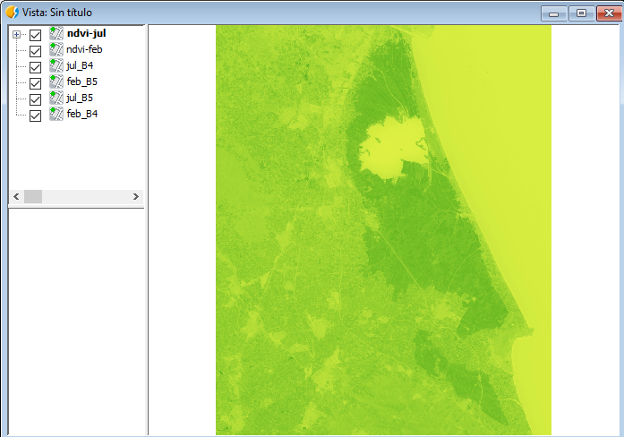

Taller: Integración de R en gvSIG
=================================

En el siguiente manual, se hace una explicación del contenido dado durante  el taller en las 12as Jornadas de gvSIG, realizadas en la Universidad Politécnica de Valencia.

Instalación
-----------

El taller está realizado sobre la versión portable de gvSIG para Windows en la versión 2.3.1. Se hace uso de la extensión de R que viene en la instalación con la portable.

`Descargar gvSIG <http://www.gvsig.com/es/productos/gvsig-desktop/descargas>`_

La extensión de R que utilizaremos, hace uso de una instalación de R que se encuentra dentro de la extensión comentada. También se muestra un ejemplo rápido donde se diferencia la ejecución de Renjin de la de R.

.. note::

	La extensión de R se encuentra en desarrollo y puedes haber limitaciones de uso en algunas distribuciones. Para cualquier duda os podéis poner en contacto con nosotros a través de las Listas de Usuario y Desarrollo.

Será necesario descargar un pack de imágenes Landsat previamente recortadas en la zona de estudio. Se ha incluido el recorte de todas las bandas.

:download:`Imágenes Landsat8 para Febrero y Julio de la zona de La Albufera <data.zip>`

Introducción
------------

Durante el taller aprenderemos:
* Mostrar cómo ejecutar scripts en Renjin
* Mostrar cómo ejecutar scripts en R
* Llamar a funciones de R desde un script de Jython
* Pasar parámetros en estas funciones
* Limitaciones de uso

El taller se realiza poniendo como objetivo una aplicación que calcula el `NDVI <https://es.wikipedia.org/wiki/%C3%8Dndice_de_vegetaci%C3%B3n_de_diferencia_normalizada>`_ a partir del recorte de 2 imagenes Landsat con sus respectivas bandas en diferentes épocas del año en la zona de la Albufera, aplicando la formula del NDVI entre ellas. El cálculo del NDVI se realizará aplicando directamente la formula del NDVI sobre las imágenes descargadas sin aplicar ninguna otra corrección.

Comenzando
----------

Para comenzar con el taller, lo primero que haremos es ejecutar gvSIG ejecutando el fichero gvsig-desktop.cmd que aparece en la carpeta de la portable. De esta forma se nos abrirá una consola junto a gvSIG que nos será de utilidad para realizar tareas de desarrollo.

Una vez abierto gvSIG, crearemos una Vista nueva. Con la Vista seleccionada en el Gestor de Proyectos, en las Propiedades de la Vista **cambiaremos la proyección a EPSG:32630**, ya que las imágenes Landsat del recorte vienen en esta proyección.

.. image:: i/2.png

Lo siguiente que haremos será cargar los datos necesarios en la Vista, a los cuales hacemos referencia desde código. En este caso **añadiremos 4 imagenes**, referentes a las bandas Roja y Infrarroja de dos imagenes Landsat, una tomada en Febrero y otra en Julio del 2016.

Capas a cargar en la Vista:
* feb_B4.tif
* feb_B5.tif
* jul_B4.tif
* jul_B5.tif

Para hacerlo podemos irnos al botón de **Agregar capas**.

También es posible arrastrando directamente desde el Explorador a gvSIG.

Cuando nos muestre la forma de cargas las capas, podemos darle a **Todas normal**.

Quedando como resultado de nuestra Vista:

Estructura del proyecto
-----------------------

Con los datos iniciales preparados vamos a pasar a la parte de programación.

Vamos en el menú a Herramientas -> Scripting -> Editor de Scripts.

Se nos abrirá el Scripting Composer o Editor de Scripts. Desde aquí tenemos todo lo necesario para la creación y ejecución de Scripts.

.. note::

	Este taller trata sobre la ejecución de R desde scripting. Si buscas más información sobre el Módulo de Scripting puedes consultar la documentación especifica del Módulo.

Lo primero será crear una carpeta que contenga nuestro módulo, en el incluiremos los scripts creados y también podríamos incluir las imágenes para hacer referencia a ellas directamente desde nuestro script de forma relativa y no haciendo referencia a las cargadas en la Vista. Durante este taller hacemos referencia a las insertadas en la Vista para facilitar el código explicado. La ventaja de tener todo contenido en una carpeta es que gvSIG nos permitirá empaquetar nuestro módulo en un paquete que podremos distribuir de forma sencilla a otros usuarios.

Continuando con la creación del módulo nuevo, vamos a irnos al botón de *Nuevo* y vamos a crear una Carpeta denominada: "taller-12jornadas-r". Seleccionamos el Type Folder, y la localización de dónde queremos crearla, en este caso, en el raíz:

Vemos que ya nos aparecerá en la estructura de scripts:

.. image:: i/114.png

Ahora crearemos una carpeta denominada *data* dentro de esta carpeta, repitiendo el proceso anterior, solo teniendo en cuenta de crearla dentro de la carpeta anterior:

Lo siguiente será crear dos scripts. El primero denominado "ejemplo" de lenguaje Python dentro de la carpeta /taller-12jornadas-r/.

.. image:: i/117.png

El segundo denominado "rejemplo" de lenguaje R dentro de la carpeta **data**:

Quedando como resultado la siguiente estructura de datos con los dos scripts ya abiertos en nuestro Editor:

Librerías de R
--------------

La instalación de R que viene con gvSIG, viene por defecto con diversas librerías de uso común en nuestro ámbito. En caso de que fuera necesario instalar otras librerías se puede realizar mediante una consola que abriremos desde el Editor de Scripts.

Para ello vamos a ir a la pestaña de Sistema que se encuentra dentro del Editor. En esta pestaña encontraremos ficheros de ejemplo y de configuración relacionados con scripting que se encuentran en diferentes módulos de gvSIG. En nuestro caso, accederemos al módulo de R y al abrirlo veremos que aparece un script denominado RShell, si hacemos doble click, aparecerá abierto en el editor:

Para ejecutarlo debemos dar a **F5** o sobre el botón de **Guardar y ejecutar**:

Veremos como se nos aparece una consola similar a la siguiente:

Esta consola es la consola de R que hace referencia a la instalación que viene dentro de nuestra extensión de R. No confundirla con la instalación de nuestro sistema.

Las librerías instaladas desde esta consola, serán accesibles desde nuestros scripts en R.

Por ejemplo, vamos a ver a instalar la librería rasterVis se la siguiente forma::

    install.packages("rasterVis")

Como vemos ya estaría instalada y accesible.

Para este taller haremos uso exclusivo de la librería de R: "raster"

Ya podemos cerrar la consola y seguiremos con nuestros scripts.

Llamando funciones de R
-----------------------

.. note::

	Algunas de las siguientes funciones de acceso a R es posible que sufran algunas modificaciones menores para facilitar su ejecución.

El código siguiente es lo mínimo necesario para le ejecución de una función en R. Se va explicando en los comentarios del código el significado de cada línea de código:

.. note::
	
	Recordar de siempre guardar cada vez que modifiquemos un script. Si la pestaña del script aparece en negrita significa que no está guardado. Sobretodo en este taller tendremos que tener cuidado al ejecutar el código del script ejemplo, ya que al hacer referencia al código rejemplo, si este último no se encuentra guardado, no podremos notar los cambios.

.. note::

	Remarcar, que siempre que ejecutemos el script, deberemos de estar en la pestaña del script que hace referencia a ejemplo.py. Si ejecutamos desde rejemplo.r, estaríamos utilizando el motor de Renjin.

Script ejemplo::

    # encoding: utf-8

    import gvsig
    import rlib

    def console(msg, otype=0):
        print msg,

    def main(*args):
        #Lanzamos el motor de R
        R = rlib.getREngine(console)

        # Estableciendo el directorio de trabajo dentro de R haciendo
        # referencia a la carpeta data creada anteriormente
        R.setwd(R.getPathName(gvsig.getResource(__file__, "data")))

        # Cargamos el codigo de R generado
        R.source(R.getPathName(gvsig.getResource(__file__,"data","rejemplo.r")))

        # Llamamos a la funcion deseada dentro del codigo de R
        R.call("mytest")

        # Finalizamos el motor de R
        R.end()

Vemos como hace referencia de forma relativa al código de rejemplo.r que se encuentra dentro del mismo módulo que hemos creado anteriormente haciendo uso de la función `gvsig.getResource`.

La función de R.getPathName nos ayudará a conseguir rutas de ficheros como capas raster (lo veremos más adelante), pero en este caso, nos ayuda a corregir la ruta del fichero que obtenemos con getResource. Esto viene porque el lenguaje R solo acepta que las rutas hagan uso de las barras "/" en sus string. Con esta formula nos aseguramos de convertirlas a este tipo.

Para ejecutar el código de R, lo que se hace es cargarlo con la función R.source(), para luego acceder a él mediante R.call(). En este caso vamos a ir a la pestaña de "rejemplo" a modificar la función que viene predeterminada en gvSIG por su nombre "mytest". Una vez modificado, recordar siempre de guardar el script.

Quedaría así.

Script de rejemplo::

    mytest <- function() {

        cat( "Hello\n" );

    }

Vemos la ejecución del script por consola:

Pasando parámetros a las funciones
----------------------------------

Algo que nos hará falta con seguridad es el pasar parámetros a las funciones de R. En nuestro caso, dada las limitaciones que ofrece la interacción entre Jython y R, solo podemos pasarle parámetros de texto.

Por ejemplo, vamos a ver como pasarle una ruta de una capa cargada en gvSIG.

Para ello, al código anterior, vamos a añadir el acceso a una de las imágenes cargadas anteriormente.

Script ejemplo::

    # encoding: utf-8

    import gvsig
    import rlib

    def console(msg, otype=0):
        print msg,

    def main(*args):
        R = rlib.getREngine(console)
        # Caso de que la capa se encontrara en carpeta data
        #b4_path = gvsig.getResource(__file__, "data", "feb_B4.tif")

        # Caso de una capa cargada en una Vista de gvSIG
        b4 = gvsig.currentView().getLayer("feb_B4")

        # La funcion getPathName se encarga de extraer el path por nosotros
        b4_path = R.getPathName(b4)

        R.setwd(R.getPathName(gvsig.getResource(__file__, "data")))
        R.source(R.getPathName(gvsig.getResource(__file__,"data","rejemplo.r")))
        # Agregamos un parametro a la funcion
        R.call("mytest", b4_path)
        R.end()

Script rejemplo::

    # Agregamos un parametro a la funcion
    mytest <- function(b4_path) {

        cat( "Capa: ", b4_path );

    }

En el resultado podemos ver como muestra la ruta de la capa:

Calculo de histograma
---------------------

Una opción que podríamos querer es el cálculo de un histograma de una imagen raster. Para ello, basándonos en el script anterior (en el cual ya le pasamos una ruta de un raster al código R), vamos a aprovechar para hacer uso de la función hist() perteneciente a la librería "raster".

.. note::

	Tener cuidado de no crear funciones de R con el mismo nombre que funciones de sus librerías, ya que de esa forma pueden entrar en conflicto.

Modificaremos el código de R con el siguiente::

    histograma <- function(b4_path) {
        # Cargamos la libreria
        library(raster)
        # Cargamos la capa desde la ruta
        b4 <- raster(b4_path)
        # Forzamos la apertura de la ventana
        x11()
        # Ejecutamos la funcion de histograma
        hist(b4)
        # Esperamos a cerrar el ultimo plot para continuar su ejecucion
        locator(1)

    }

Ya que hemos cambiado el nombre de la función, modificamos la línea correspondiente en el script de ejemplo::

    R.call("histograma", b4_path)

El resultado esperado será algo similar a:

Una de las diferencias de ejecutar código de R de esta forma respecto a, por ejemplo, desde RStudio, es que para mostrar las gráficas (plots) debemos de forzar la salida de la ventana y su espera para su correcta visualización. Esto se consigue mediante x11() y locator(). x11() nos abre una ventana correspondiente al plot, y locator nos obliga a esperar el cierre del plot para continuar con la ejecución del programa.

.. note::

	La mayor parte de las funciones que aparecen en este taller como hist(), x11() y otras, tienen una gran cantidad de parámetros extra que se pueden establecer para modificar su comportamiento a la hora de ejecutarse. Estos parámetros los puedes encontrar buscando directamente en Google y accediendo a la documentación correspondiente de las librerías de R.

Calculo del NDVI
----------------

Para realizar el cálculo del NDVI vamos a realizar una pequeña reestructuración de nuestro código que nos facilitará las cosas. Por el resto, contendrá lo mismo que lo enseñado anteriormente, se le pasarán dos parámetros a las funciones de R en vez de uno, y se creará una función de ejemplo que será llamada desde la función principal main().

.. note::

	En este ejemplo eliminamos la línea R.setwd ya que no estamos utilizándola realmente desde R. También podría ser establecida desde nuestro código de R.

Vamos a ver cómo quedaría::

    # encoding: utf-8

    import gvsig
    import rlib

    def console(msg, otype=0):
        print msg,

    def calculo(b4_name, b5_name, ndvi_func, ndvi_name):

        R = rlib.getREngine(console)

        # Path desde la capa y corregido
        b4 = gvsig.currentView().getLayer(b4_name)
        b5 = gvsig.currentView().getLayer(b5_name)

        #Parametros
        b4_path = R.getPathName(b4)
        b5_path = R.getPathName(b5)
        ndvi_path = R.getPathName(gvsig.getTempFile("ndvi", ".tif"))

        R.source(R.getPathName(gvsig.getResource(__file__, "data", "rejemplo.r")))
        R.call(ndvi_func, b4_path, b5_path, ndvi_path)
        R.end()

        r1 = gvsig.loadRasterFile(ndvi_path)
        r1.setName(ndvi_name)
        return ndvi_path

    def main(*args):
        feb = calculo("feb_B4", "feb_B5", "ndvi", "ndvi-feb")
        jul = calculo("jul_B4", "jul_B5", "ndvi", "ndvi-jul")

Y en R::

    ndvi <- function(b4_path, b5_path, ndvi_path) {
      library(raster)
      b4 <- raster(b4_path)
      b5 <- raster(b5_path)
      ndvi <- overlay(b4, b5, fun = function(x, y) {
          (y-x) / (y+x)
      })
      writeRaster(ndvi, ndvi_path, format = "GTiff")
    }

Con la función gvsig.getTempFile(nombre, extension), estamos obteniendo una ruta temporal para la capa que se creará en R y la cual pasamos como parámetro. Esta función se utiliza para evitar la introducción de un nombre de capa fijo, el cual puede dar problemas al ejecutar el script por segunda vez y que al encontrar que ya existe una capa con el mismo nombre, nos aparezca un error y se cancele la ejecución.

En el código de R podríamos tener diferentes funciones incluidas al mismo tiempo, ya que en el R.call(nombre), es donde indicamos qué función ejecutar.

Para el cálculo del ndvi hacemos uso de la función overlay que viene en la librería de raster. Esta función nos permite mezclar dos raster respecto a una función introducida. En nuestro caso, esta función será la fórmula del cálculo del NDVI. Para  un correcto funcionamiento y rápido de este código (con motivo de ser un taller), los recortes de los raster deben de ser del mismo tamaño y zona.

Después de la ejecución del código, veremos como en nuestra Vista se han cargado dos capas raster, correspondientes al ndvi de Febrero y de Julio.

El NDVI siempre viene con un rango de -1 a 1 así que vamos a darle una correcta tabla de color.

Para ello, click derecho sobre la imagen seleccionada y vamos al menu de Tablas de Color:

Seleccionaremos la Librería que aparece en segundo lugar de "Soil - Forest". Activaremos la opción abajo a la izquierda de Tablas de color, y vamos a ajustar los límites diciéndole los valores de -1 a 1. Después de esto, aplicaremos y aceptaremos. Repetiremos el proceso con la otra imagen. Nos dará como resultado algo como lo siguiente:

En las imágenes ya podemos apreciar cómo en Julio, cuando el arroz está florecido en la zona de La Albufera, se aprecian unos indices de vegetación más altos. Por contra, apenas se nota nada en la imagen de Febrero, cuando el arroz no está plantado.

Para visualizar mejor la diferencia entre las dos épocas, vamos a hacer una resta de las dos imagenes resultado. Vamos a aprovecharnos de lo que ya tenemos.

Por ejemplo, vemos en nuestro código que en la función `calculo` devolvemos el path de la imagen resultante, de esta forma podemos utilizarla de nuevo. Además, los parámetros que utilizamos son los mismos que en el anterior, dos capas raster y una de salida, así que reutilizaremos también la función de `calculo`, solo crearemos una nueva función en R. La función en R será la misma que la del ndvi, solo modificaremos la fórmula a usar en la función overlay.

.. note::

	Para poder realizar esto con facilidad, hemos tenido en cuenta en renombrar las imágenes cada vez que las cargamos en la Vista con un nombre fácil de acceder.

Quedando así el script ejemplo::

    # encoding: utf-8

    import gvsig
    import rlib

    def console(msg, otype=0):
        print msg,

    def calculo(b4_name, b5_name, ndvi_func, ndvi_name):

        R = rlib.getREngine(console)

        # Path desde la capa y corregido
        b4 = gvsig.currentView().getLayer(b4_name)
        b5 = gvsig.currentView().getLayer(b5_name)

        #Parametros
        b4_path = R.getPathName(b4)
        b5_path = R.getPathName(b5)
        ndvi_path = R.getPathName(gvsig.getTempFile("ndvi", ".tif"))

        R.source(R.getPathName(gvsig.getResource(__file__, "data", "rejemplo.r")))
        R.call(ndvi_func, b4_path, b5_path, ndvi_path)
        R.end()

        r1 = gvsig.loadRasterFile(ndvi_path)
        r1.setName(ndvi_name)
        return ndvi_path

    def main(*args):
        feb = calculo("feb_B4", "feb_B5", "ndvi", "ndvi-feb")
        jul = calculo("jul_B4", "jul_B5", "ndvi", "ndvi-jul")
        dif = calculo("ndvi-feb", "ndvi-jul", "diferencia", "diferencia")

Y el script de rejemplo::

    ndvi <- function(b4_path, b5_path, ndvi_path) {
      library(raster)
      b4 <- raster(b4_path)
      b5 <- raster(b5_path)
      ndvi <- overlay(b4, b5, fun = function(x, y) {
          (y-x) / (y+x)
      })
      writeRaster(ndvi, ndvi_path, format = "GTiff")
    }

    diferencia <- function(b4_path, b5_path, ndvi_path) {
      library(raster)
      b4 <- raster(b4_path)
      b5 <- raster(b5_path)
      ndvi <- overlay(b4, b5, fun = function(x, y) {
          (y-x)
      })
      writeRaster(ndvi, ndvi_path, format = "GTiff")
    }

Dando como resultado una imagen que si le aplicamos una tabla de color veremos dónde se han producido las mayores diferencias en las imágenes correspondientes al NDVI entre Febrero y Julio:

Otra forma de visualizar estas imágenes sería mediante un rasterstack, para ello hacemos lo mismo, agregamos una función nueva según nuestras necesidades.

Script ejemplo::

    # encoding: utf-8

    import gvsig
    import rlib

    def console(msg, otype=0):
        print msg,

    def calculo(b4_name, b5_name, ndvi_func, ndvi_name):

        R = rlib.getREngine(console)

        # Path desde la capa y corregido
        b4 = gvsig.currentView().getLayer(b4_name)
        b5 = gvsig.currentView().getLayer(b5_name)

        #Parametros
        b4_path = R.getPathName(b4)
        b5_path = R.getPathName(b5)
        ndvi_path = R.getPathName(gvsig.getTempFile("ndvi", ".tif"))

        R.source(R.getPathName(gvsig.getResource(__file__, "data", "rejemplo.r")))
        R.call(ndvi_func, b4_path, b5_path, ndvi_path)
        R.end()

        r1 = gvsig.loadRasterFile(ndvi_path)
        r1.setName(ndvi_name)
        return ndvi_path

    def rasterstack(r1, r2, r3):
        R = rlib.getREngine(console)
        R.source(R.getPathName(gvsig.getResource(__file__, "data", "rejemplo.r")))
        R.call("rasterstack", r1, r2, r3)
        R.end()

    def main(*args):
        feb = calculo("feb_B4", "feb_B5", "ndvi", "ndvi-feb")
        jul = calculo("jul_B4", "jul_B5", "ndvi", "ndvi-jul")
        dif = calculo("ndvi-feb", "ndvi-jul", "diferencia", "diferencia")
        # siendo los siguientes parametros las rutas de las imagenes resultado
        rasterstack(feb, jul, dif)

Script rejemplo::

    ndvi <- function(b4_path, b5_path, ndvi_path) {
      library(raster)
      b4 <- raster(b4_path)
      b5 <- raster(b5_path)
      ndvi <- overlay(b4, b5, fun = function(x, y) {
          (y-x) / (y+x)
      })
      writeRaster(ndvi, ndvi_path, format = "GTiff")
    }

    diferencia <- function(b4_path, b5_path, ndvi_path) {
      library(raster)
      b4 <- raster(b4_path)
      b5 <- raster(b5_path)
      ndvi <- overlay(b4, b5, fun = function(x, y) {
          (y-x)
      })
      writeRaster(ndvi, ndvi_path, format = "GTiff")
    }

    rasterstack <- function(r1_path, r2_path, r3_path) {
      library(raster)
      r1 <- raster(r1_path)
      r2 <- raster(r2_path)
      r3 <- raster(r3_path)
      s1 <- stack(r1, r2, r3)
      x11()
      plot(s1)
      locator(1)
    }

Dando como resultado un plot con las siguientes imagenes:

Este plot podría ser guardado en formato imagen y agregado a un informe que fuera parte de uno de nuestros scripts, por ejemplo.

.. note::

	Cualquier duda o error os podéis poner en contacto con nosotros directamente a través de las `Listas de Desarrollo <http://www.gvsig.com/es/comunidad/listas-de-correo>`_
